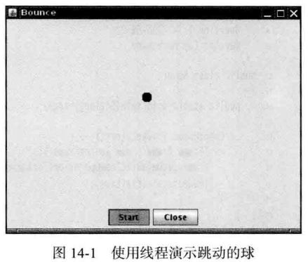
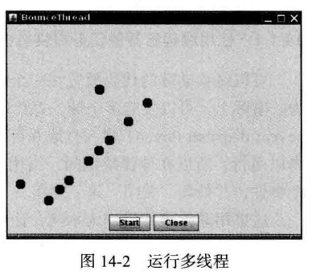

# 基本概念

1）多任务发展史：

**step1：**多任务（multitasking）：操作系统在同一时刻运行多个**程序（进程）**的能力。如，在编辑或下载邮件的同时打印文件。操作系统将CPU的时间片分配给每一个**进程**，给人并行处理的感觉。

**step2：**多线程扩展了1）中的多任务概念，即：将多任务扩展到了**线程级别**。

**==多任务==**：一个程序（进程）同时执行多个任务（线程）的能力。每一个任务称为一个线程（Thread）

多线程程序（multithreaded）：可同时运行一个以上现成的程序

**总结**：上述是**多进程到多线程**的发展史。

2）多进程与多线程的区别

本质区别：每个进程拥有自己的一整套变量，而线程在进程内部共享数据。

线程优点：

- 共享变量使线程之间的通信比进程之间的通信更有效、更容易
- 线程更轻量级，其创建、撤销比进程的开销小得多

# 14.1 什么是线程

14.1.1 使用线程给其其他任务提供机会

1）单进程与多线程

- 单进程（单线程）

一个进程（线程）时，此线程完全控制了整个应用程序，导致用户无法与此程序进行良好的交互

- 多线程

  

无论何时点击start按钮，都会创建一个新线程（出现一个球）；无论何时点击close，都可以立即结束此程序（进程）

# 14.2 中断线程

# 14.3 线程状态

14.3.1 新创建线程

14.3.2 可运行线程

14.3.3 被阻塞线程和等待线程

14.3.4 被终止的线程

# 14.4 线程属性

14.4.1 线程优先级

14.4.2 守护线程

14.4.3 未捕获异常处理器

# 14.5 同步

14.5.1 竞争条件的一个例子

14.5.2 竞争条件详解

14.5.3 锁对象

14.5.4 条件对象

14.5.5 synchronize关键字

14.5.6 同步阻塞

14.5.7 监视器概念

14.5.8 Volatile域

14.5.9 final变量

14.5.10 原子性

14.5.11 死锁

14.5.12 线程局部变量

14.5.13 锁测试与超时

14.5.14 读/写锁

14.5.15 为什么启用stop和suspend方法

# 14.6 阻塞队列

# 14.7 线程安全的集合

14.7.1 高效的映射、集合队列

14.7.2 映射条目的原子更新

14.7.3 对并发散列映射的批操作

14.7.4 并发集视图

14.7.5 写数组的拷贝

14.7.6 并行数组算法

14.7.7 较早的线程安全集合

# 14.8 Callable与Future

# 14.9 执行器

14.9.1 线程池

14.9.2 预定执行

14.9.3 控制任务组

14.9.4 Fork-Join框架

14.9.5 可完成Future

# 14.10 同步器

14.10.1 信号量

14.10.2 倒计时门栓

14.10.3 障栅

14.10.4 交换器

14.10.5 同步队列

# 14.11 线程与Swing

14.11.1 运行耗时的任务

14.11.2 使用Swing工作线程

14.11.3 单一线程规则