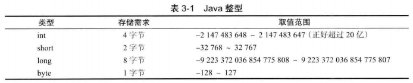
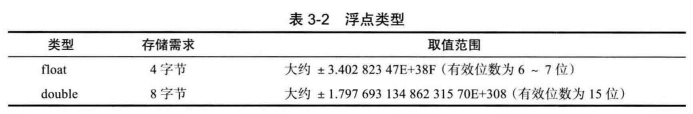
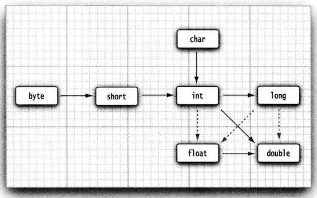
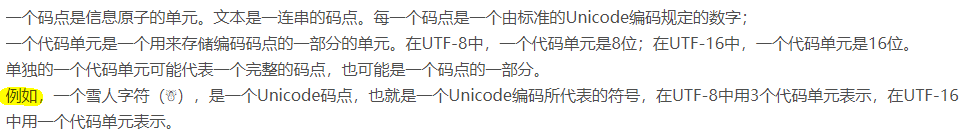
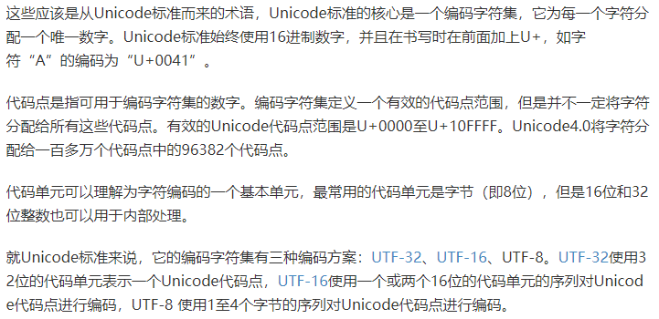
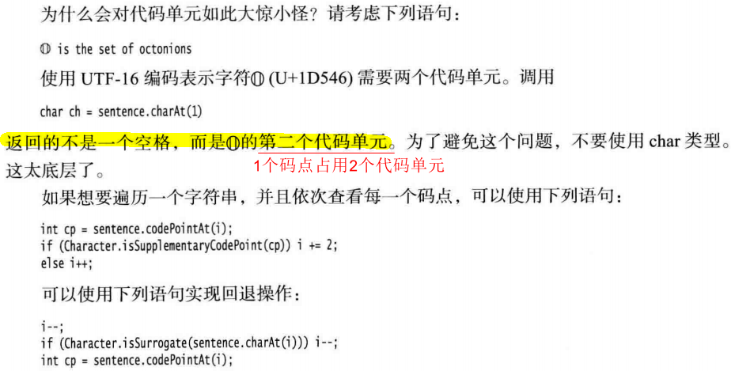

# 3.1 一个简单的Java应用程序

- Java严格区分大小写
- 访问修饰符（`access modifier`），用于控制程序的其它部分对这段代码的访问级别。如：`public`
- 标准命名规范：
  - 类名：以大写字符开头的名词，若名字由多个单词组成，每个单词第一个字母都应该大写（这种在单词间使用大写字母的方式称为：骆驼命名法，如：`CamelCase`）
  - 源代码文件命名：必须与公共类名字相同，并用`.java`作为扩展名。
- 运行已编译的程序时，Java虚拟机从指定类中的`main`方法开始执行
- Java中任何方法的代码都用`{`开始，`}`结束
- 字符串分割：双引号`" string "`

# 3.2 注释

- 注释不会出现在可执行程序中
- 三类注释：
  - `//`，单行注释
  - `/* */`，段注释
  - `/** */`，文档注释，可用于生成文档

# 3.3 数据类型

- Java是强类型语言，必须为每一个变量声明一种类型
- Java的8种基本数据类型（`primitive type`）
  - 4种整形
  - 2种浮点型
  - 1种字符类型：`char`（用于表示Unicode编码的字符单元）
  - 1种真值类型：`boolean`

## 3.3.1 整型

- 整型：表示没有小数部分的数值，允许是负数

- 4种整型

  

  注意：int的范围：`（-2^31  ，2^31 - 1）`

- Java中，所有数值类型所占据的字节数量与平台无关，各种数据类型的取值范围是固定的（提升软件平台移植性）。C/C++中，数据类型的大小与平台相关。
  Java没有任何无符号（unsigned）形式的int、long、short或byte类型

- long int（长整型）有一个后缀：`L`或`l`，如：400000000L

  十六进制数值有一个前缀：`0x`或`0X`，如：0xCAFE

  八进制有一个前缀：`0`，如：010（八进制中的8）

  二进制数（==Java 7 新特性==）加上前缀：`0b`或`0B`，如：0b1001（十进制：9）

  - 还可为数字字面量加上下划线，如：0b1111_0100_0010_0100_0000（十进制：100万）

## 3.3.2 浮点类型

- 浮点类型用于表示：有小数部分的数值。2中浮点类型

  

  float类型，有一个后缀f或F，如：3.14F

  double类型（最常用），有一个后缀d或D，或者无后缀，如：3.14D、3.14（没有后缀F的浮点数值默认为double类型）

## 3.3.3 char类型

- char类型，用于表示单个字符
- char类型的字面量值要用：单引号括起来。如：`'A'`，而`"A"`表示字符串。
- 警告：Unicode转义序列会在解析代码之前得到处理

## 3.3.4 Unicode和char类型

- Unicode解决了：
  - 同一代码值，不同编码方案下可能对应不同的字母
  - 同一字符，不同编码方案下编码长度不同

## 3.3.5 boolean类型

- boolean（布尔）类型有两个值：false和true，用于判定：逻辑条件
- 注意：整形值和布尔值之间不能进行相互转换。但，在C++中，数值甚至指针可以代替boolean值，如：0相当于布尔值false，非0相当于布尔值true

# 3.4 变量

变量

- 变量名对大小写敏感
- 声明一个变量后，必须用赋值语句对变量进行显式初始化，不能直接使用

常量

- final修饰，常量只能被赋值一次
- 常量名，一般使用**全大写**

- 类常量：可在一个类中的多个方法中使用，用：`static final`修饰

# 3.5 运算符

- 算数运算符：`+、-、*、/、%`
- 上述都是双目运算符，
  - 参与运算的两个操作数都是整数时，表示：整数运算
  - 否则，至少存在一个操作数非整数时，表示：浮点除法
- `/ 与 %`：除法 与 求余（取模）
  如：15 / 2 = 7、15.0 /  2 = 7.5、15 % 2 = 1
- 注意：
  - 整数 / 0，产生异常
  - 浮点数 / 0，得到无穷大 或 NaN结果

## 3.5.2 数值类型之间的转换



- 6个实心箭头，表示无信息丢失的转换

- 3个虚箭头，表示可能有精度损失的转换

  ```java
  int n = 123456789;
  float f = n; //1.23456792E8
  ```

## 3.5.3 强制类型转换

- double -> int：通过截断小数部分将浮点值转为整形

  ```java
  double x = 9.997;
  int nx = (int) x; // 9
  ```

- 复合赋值运算符中的强制类型转换

  ```java
  int x = 1;
  x += 3.5; // x = (int)(x + 3.5) -> x = 4 
  ```

## 3.5.6 逻辑运算符

- `&& || ！`：与、或、非（短路方式）
  `& |`：and or（非短路方式）

- `&&、||`按照“短路”方式来求值：如果第一个操作数能够确定表达式的值，第二操作数就不必计算了。

  如：$expression_1$&&$expression_2$，`x != 0 && 1 / x > x + y`，如果x=0，则第二部分不会计算。

- 三元操作符：condition？expression<sub>1</sub>$:$expression<sub>2</sub>

## 3.5.8 括号与运算符级别

- 如果不使用圆括号，按运算符优先级次序进行计算

- 同一级别的运算符按照从左到右的次序进行计算（除了：右结合运算符）

  如：

  - a&&b||c => (a&&b)||c
  - a += b += c => a += (b += c)，即：将 **b** += **c** 的结果（加上 **c** 之后的 **b**) 加到 **a** 上。

# 3.6 字符串

概念

- Java字符串就是Unicode字符序列。

- 每个用双引号括起来的字符串都是String类的一个实例，如：

  ```java
  String e = "";
  String greeting = "hello";
  ```

3.6.2 拼接

- Java语言使用 + 号连接（拼接）两个字符串，拼接字符串时，都会新建一个String对象，详情见：3.6.9
- 任何一个 Java 对象都可以转换成字符串

3.6.3 不可变字符串

- String类**字符串字面量**，同一**字符串常量**存在公共的存储池中，即：字符串常量是共享，如：

  ```java
  String greeting = "hello";
  String greeting1 = "hello";
  System.out.println(greeting == greeting1); //true
  ```

- String类还有**字符串变量**，如：

  ```java
  String s1 = new String("hello");
  String s2 = new String("hello");
  System.out.println(s1 == s2);//false
  ```

3.6.6 码点与代码单元

- Java内置Unicode编码，采用：UTF-16编码表示码点的代码单元，即：一个代码单元占了16位

- 码点：Unicode里的字符；代码单元：字符对应的存储空间

  > 一般是一个码点对应一个代码单元，但也有：一个码点对应多个代码单元（此时，使用charAt容易出错）

  

  

3.6.7 String API

- char charAt(int index)：返回给定位置的代码单元，一般不推荐

  

3.6.9 构建字符串（StringBuilder）

两种方式：

- 方式1：拼接字符串，每次拼接时，都会构建一个新的String对象。效率低，耗时，浪费空间。
- 方式2：StringBuilder，对同一个字符串处理

# 3.7 输入输出

3.7.1 读取输入

- Scanner类
- Console类（JDK 6）

3.7.2 格式化输出

- `System.out.printf()`（JDK 5）（非println）

  ```java
  double x = 10000.0 / 3.0;
  System.out.println(x);//3333.3333333333335
  		
  System.out.printf("%8.2f", x);// 3333.33
  ```

3.7.3 文件输入与输出

路径2种表示方法

- 双重反斜杠：`c:\\mydirectory\\myfile.txt`

- 单斜杠：`/home/me/mydirectory/myfile.txt`

# 3.8 控制流程

Java使用条件语句和循环结构确定控制流程

3.8.1 块作用域

- 块（复合语句）：由一对大括号括起来的若干条简单的Java语句，确定了变量的作用域。

  > 使用块 （ 有时称为复合语句）可以在 Java 程序结构中原本只能放置一条 （ 简单）语
  >
  > 句的地方放置多条语句。 

- 一个块可嵌套在另一个块中，但不能在嵌套的两个块中声明相同的变量（C++中可以）。

  ```java
  public static void main(String[] args) {
  		int n;
  		{
  			int k;
  			int n; // Duplicate local variable n
  		}
  }
  ```

3.8.2 条件语句

- else 子句与最邻近的 if 构成一组

3.8.3 循环

- while循环：先检测循环条件，循环体可能不执行
- do while循环：循环体至少执行一次，再检测循环条件

3.8.4 确定循环

- while循环的一种简化形式

- 作用域：
  （1）当在 for 语句的第 1 部分中声明了一个变量之后，这个变量的作用域就为 for 循环的整个

  循环体。

  ```java
  for (int i = 1; i <= 10; i++) {
      
  } // i no longer defined here
  ```

  （2）**特别指出**：**如果在 for 语句内部定义一个变量， 这个变量就不能在循环体之外使用**。因 

  此， 如果希望在 for 循环体之外使用循环计数器的最终值，就要确保这个变量在循环语句的

  前面且在外部声明！

  ```java
  int i ;
  for (i = 1; i <= 10; i++) {
      
  }// i is still defined here
  ```

  （3）可以在各自独立的不同 for 循环中定义同名的变量

  ```java
  for (int i = 1; i <= 10; i++){
      
  }
  for (int i = 11; i <= 20; i ++) {// OK to define another variable named i
  
  }
  ```

3.8.5 多重选择：switch语句

- 在处理多个选项时， 使用 if/else 结构显得有些笨拙，可使用：switch
- case标签可为：
  - 类型为：char byte short int的常量表达式
  - 枚举常量
  - 字符串字面量（字符常量）（JDK 7）

3.8.6 中断控制流程语句

- break

- break label;（带标签的break语句，用于**跳出多重嵌套的循环语句**）

  ```java
  label: //标签必须放在希望跳出的最外层循环之前， 并且必须紧跟一个冒号。
  ...
  ...
  break label;//跳出多重循环
  // jumps here when the break statement executes
  ...
  ```

- continue

# 3.9 大数值

概念：如果基本的整数和浮点数精度不能够满足需求， 可使用java.math 包中的两个类：Biglnteger 和 BigDecimaL ，可以处理**包含任意长度数字序列的数值**。

- Biglnteger 类实现了任意精度的**整数**运算
  BigDecimal 实现了任意精度的**浮点数**运算

- 函数：
  valuerOf：普通数值转为大数值

  add、multiply：加法和乘法

# 3.10 数组

概念：

- 数组是一种数据结构，用于存储同一类型数值的集合。
- 两种形式声明数组
  - `int[] a`
  - `int a[]`
- 使用new运算符创建数组
- 一旦创建了数组，就不能再改变它的大小
- new出数组后，默认初始化值：
  - 数字数组：0
  - boolean数组：false
  - 引用数组/对象数组：null
    如：`String[] names = new String[10]; //所有字符都是null`

3.10.1 for each循环

增强型for循环格式

- `for (variable : collection) statement`

  collection 这一集合表达式必须是一个数组或者是一个实现了 Iterable 接口的类对象（例如

  ArrayList)

- foreach 循环语句的循环变量将会遍历数组中的**每个元素**， 而**不需要使用下标值**

- 传统for循环 与 foreach

  - foreach：遍历所有元素，不使用下标值
  - 传统for：不希望遍历集合中每个元素，需要使用下标值

3.10.2 数组初始化以及匿名数组

- 简化书写形式：创建数组对象并同时赋予初始值

  `int[] arr = {1, 2, 3, 4, 5, 6};`

- 初始化匿名数组
  `small Primes = new int[]{1, 2, 3, 4, 5, 6};`

  特点1：创建一个新数组并利用括号中提供的值进行初始化，数组的大小就是初始值的个数

  特点2：可以在**不创建新变量**的情况下**重新初始化一个数组**

3.10.3 数组拷贝

