# 4.1 面向对象程序设计概述

- 程序 = 算法 + 数据结构

4.1.1 类

- 类（class）是构造对象的模板或蓝图，由类构造（construct）对象的过程称为创建类的实例（instance）
- 封装（encapsulation，又叫：数据隐藏）
  - 形式上看：封装是将数据和行为组合在一个包中，并对对象的使用者隐藏了数据的实现方式。
  - 对象中的数据称为：实例域（instance field）；操纵数据的过程称为：方法（method）
  - 封装给对象赋予了“黑盒”特征 -> 提高重用性和可靠性的关键
- 继承（inheritance）
  - 扩展一个类来建立另外一个类的过程

4.1.2 对象

4.1.3 识别类

- 识别类的简单规则：在分析问题的过程中**属性**寻找**名词**，而**方法**对应着**动词**【找名词找动词】。

4.1.4 类之间的关系

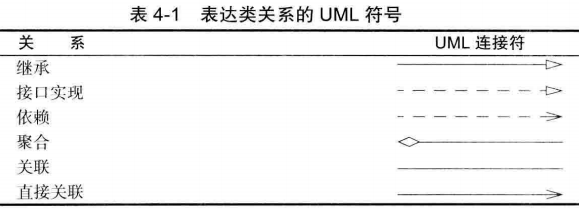

- 依赖（dependence），即：uses-a关系。

  - 语义：一个类A使用到了另一个类B，但是这种使用关系是具有偶然性的、临时性的、非常弱的，但是类B的变化会影响到类A
  - 语法：类B作为类A的方法的参数（或者局部变量）存在

- 关联（Association）

  - 语义：

    i. 比依赖关系强，必然的，长期的，强烈的；

    ii. 分为单向关联（只是班级中增加了学生）、双向关联（在学生中也添加班级属性）

    iii. 分为一对一（学生和学生证）、一对多（班级和学生）、多对多关联（学生和课程）

    iv. 有两个类的关联（客户和订单、订单和商品）、还有一个类和自身关联（领导也是员工）

  - 语法：类B作为成员变量形成存在于类A中

- 聚合（aggregation），即：has-a关系。

  - 语义：

    i.关联关系的一种特例

    ii. 整体和部分的关系

    iii. 整体部分可分离，整体的生命周期和部分的**生命周期不同**，has-a的关系

  - 语法：同关联关系

- 组合（composition）

  - 语义：

    i. 关联关系的一种特例

    ii. 整体和部分关系、整体部分不可分离、比聚合更强 ，contains-a的关系

    iii. 整体的生命周期和部分的生命周期相同

    iv. 人和四肢的关系

  - 语法：同关联关系

- 实现（realization）

  - 语义：
    i. 类和接口之间的关系；

    ii. 一个类可以实现多个接口，实现所有接口的功能；体现了规范和实现分离的原则

  - 语法：implements

- 继承（inheritance）

  - 语义：
    i. 类和子类的关系，接口和子接口的关系；

    ii. 一个类（称为子类、子接口）继承另外的一个类（称为父类、父接口）的功能，并可以增加它自己的新功能

  - 语法：extends

**总结**：

- 继承和实现一般没有争议

- 关系的强弱：组合>聚合>关联>依赖。

- 关联和依赖的区别：

  - i. 关联关系强、长期

  - ii. 关联关系是通过属性来实现；依赖关联是通过方法形参或者局部变量实现

- 关联、组合/聚合的异同

  - i. 相同：都是关联，都是做类的属性

  - ii. 不同点：组合 /聚合表示的是整体和部分的关系，关联可以表示所有关系

- 组合和聚合的异同
  - i. 相同：都是关联的特例，都是表示的整体和部分的关系
  - ii. 不同点：整体部分的生命周期是否相同? 组合更强

参考链接：https://blog.csdn.net/qq_36421955/article/details/80824092

# 4.2 使用预定义类

4.2.1 对象与对象变量

- Java中，使用构造器（constructor）构造新实例。
  构造器是一种特殊的方法，用来构造并初始化对象；构造器的名字与类名相同。
- 对象变量与对象
  - **对象变量**：
    - 并没有实际包含一个对象，而仅仅引用一个对象，即：对象变量里存储对象的地址。
    - 任何对象变量的值都是对存储在另外一个地方的一个对象的引用。
    - new操作符返回值是一个对象的引用（地址）
  - 对象变量初始化
    - new新对象，如：dealine = new Date();
      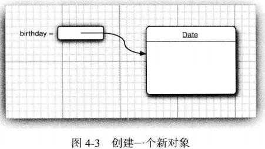
    - 指向已存在对象，如：deadline = birthday;
      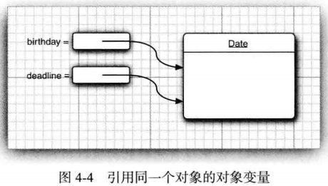

4.2.2 Java类库中的LocalDate类

- Date类：用来表示时间点
- LocalDate类：日历表示（JDK 8有所更新）

4.2.3 更改器方法与访问器方法

- setter和getter
- CalendarTest.java：实现本月的日历显示

# 4.3 用户自定义类

4.3.1 Employee类

- 类定义模板：

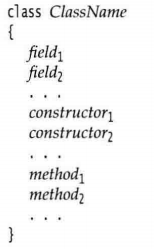

- 在一个源文件中，只能有一个公共类，但可以有任意数目的非公有类

  源文件编译后，一个类对应一个`.class`文件

4.3.2 多个源文件的使用

- EmployeeTest.java使用了Employee类时，`javac EmployeeTest.java`会自动查找名为Employee.class的文件，若未找到，则：自动搜索Employee.java，然后对它进行编译。

4.3.3 剖析Employee类

- public方法：任何类任何方法都可以调用此方法
- private属性：仅此类Employee类自身的方法能够访问这些属性，其它类的方法不可访问，即：实现了封装。

4.3.4 从构造器开始

构造器的特点

- 构造器与类同名
- 每个类可以有一个以上的构造器
- 构造器可以有0个、1个或多个参数
- 构造器没有返回值
- 构造器总是伴随着new操作一起调用

4.3.5 隐式参数与显式参数

显式参数：在方法参数列表或方法体内声明的参数

隐式参数：类的属性。关键字`this`表示隐式参数。

```java
	private String name;
	private double salary;
	private LocalDate hireDay;
	
	// 显式参数：double byPercent
	// 隐式参数：this.salary
	public void raiseSalary(double byPercent) {
		double raise = this.salary * byPercent / 100;
		this.salary += raise;
	}
```

4.3.6 封装的优点

特别注意：不要编写返回引用可变对象的getter方法，如：

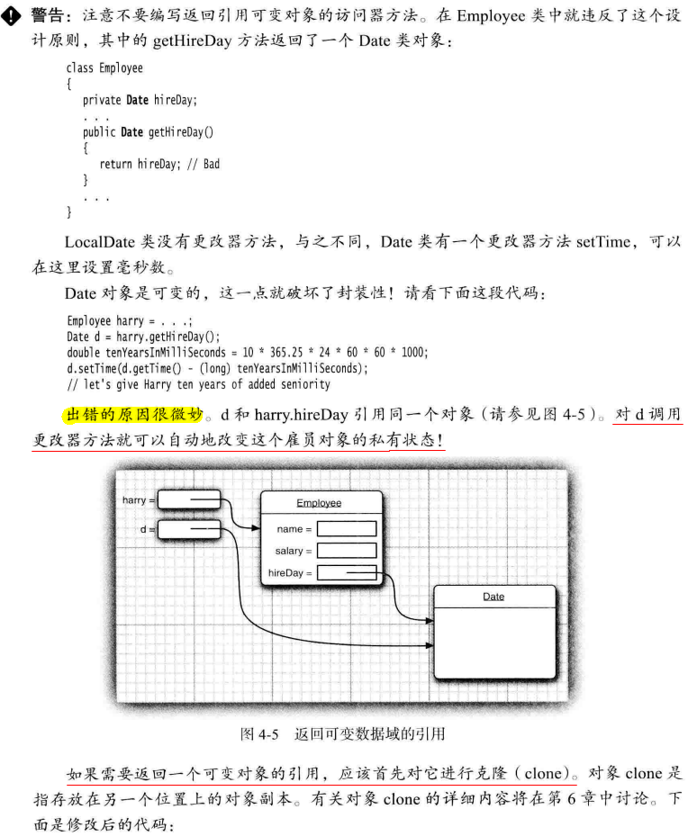

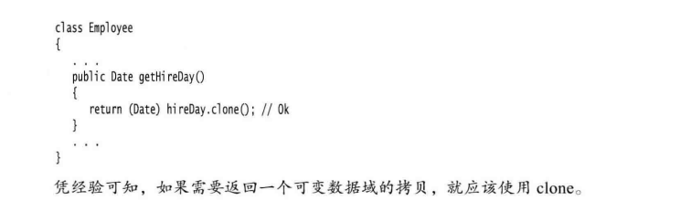

4.3.7 基于类的访问权限

- 一个类方法可以访问该类所有私有属性

4.3.8 私有方法

- 私有方法不会被此类以外的其他类调用

4.3.9 final实例域

- final修饰的属性（对象引用），对象构建之后引用不可更改（地址指向不可变）

# 4.4 静态域与静态方法

4.4.1 静态域

- 静态域又称为：类域，`static`每个类中只有一个这样的域。如：

  ```java
  class Employee{
      private static int nextId = 1;//静态域
      private int id;//实例域
  }
  1000个Employee对象，就有1000个实例域id
  1000个Employee对象，只有1个静态域nextId，它属于类，不属于任何独立对象
  ```

4.4.2 静态常量

静态域里有：静态变量 和 静态常量，静态常量多用，如：

```java
public class Math{
    ...
    public static final double PI = 3.14159265358979323846;
    ...
}
```

4.4.3 静态方法

类的静态方法里不能使用非静态属性，如：

```java
	private LocalDate hireDay;
	private int id;//实例域
	
	static {
		id = 6; // 提示：Cannot make a static reference to the non-static field id
	}
```

两种方式调用：

- `类名.方法`
- `类对象引用.方法`(不推荐)

4.4.4 工厂方法

静态方法的一个常见用途：

- 使用静态工厂方法（*factory method*）来构造对象，如：

  ```java
  NumberFormat currencyFormatter = NumberFormat.getCurrencylnstanceO;
  NumberFormat percentFormatter = NumberFormat.getPercentlnstance()；
  double x = 0.1;
  System.out.println(currencyFormatter.format(x)); // prints SO.10
  System.out.println(percentFomatter.format(x)); // prints 10%
  ```

4.4.5 main方法

- 每个类只可以有一个main方法

- StaticTest.java

  - static变量在对象创建前已经存在，所以可以在对象方法里直接使用，如：

  ```java
  private static int nextId = 1;
  public void setId() {
  		id = nextId; // id:属性 nextId:static
  		nextId++; //用于计数员工数
  }
  ```

  - static方法里不可直接使用类属性，因为：对象未创建，属性不存在，只能使用static变量，如：

  ```java
  	private LocalDate hireDay;
  	private int id;//实例域
  	
  	static {
  		id = 6; // 提示：Cannot make a static reference to the non-static field id
  	}
  ```

# 4.5 方法参数

**总结**：JVM中`static`域 和 实例域，先有`static`域 ，再有实例域，这就决定了：

- static方法中，仅可使用：
  - static变量
  - static方法
- 实例方法中，可使用：
  - 实例方法 和 static方法
  - 实例属性 和 static属性

简而言之：后来者选择多！

---

==**方法参数传递**==：

- 按值调用（call by value）：表示方法接收的是调用者提供的值
- 按引用调用（call by reference）：表示方法接收的是调用者提供的变量地址

==特别注意==：Java程序设计语言**只采用按值调用**，即：方法得到的是所有参数值的一个拷贝，特别是，方法不能修改传递给它的任何参数变量的内容。

**方法参数分为两类**：

- 基本数据类型，如：

  ```java
  // doesn't work
  public static  void tripleValue(double x) {
  	x = 3 * x;
  }
  
  double percent = 10;
  tripleValue(percent);//percent=10的值拷贝给x，调用方法结束后x不再使用
  ```

  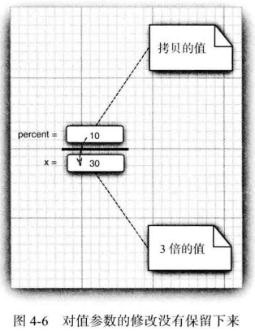

- 对象引用

  ```java
  // works
  public static void tripleSalary(Employee x) {
  	x.raiseSalary(200);
  	System.out.println("End of method: salary = " + x.getSalary());
  }
  
  Employee harry = new Employee("harry", 50000);
  tripleSalary(harry);// harry = x = Employee对象的地址
  ```

  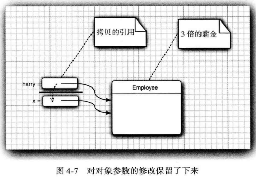

Q：如何证明Java不是引用调用？

A：

```java
	// doesn't work
	public static void swap(Employee x, Employee y) {
        // x refers to Alice, y to Bob
		Employee temp = x;
		x = y;
		y = temp;
        // now x refers to Bob, y to Alice
	}

	Employee a = new Employee("Alice", 70000);
	Employee b = new Employee("Bob", 60000);
	swap(a, b);
```

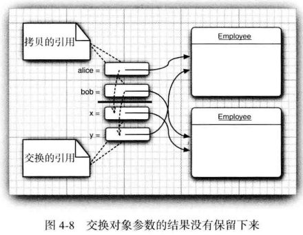

**说明**：在方法结束时参数变量x和y被丢失，原来的变量a和b仍然引用这个方法调用之前所引用的对象

# 4.6 对象构造

4.6.1 重载

- 重载（overloading）：多个方法有相同的名字、不同的参数
- 编译器如何区分重载？
  通过参数列表参数的值类型
- 方法返回类型不构成重载，即：不能有两个名字相同、参数类型相同却返回不同类型值的方法

4.6.2 默认域初始化

如果在构造器中没有显式地给属性赋予初值，则会被自动地赋为默认值：

- 基本数据类型：0
- 布尔类型：false
- 对象引用：null

4.6.3 无参数的构造器

- 仅当类没有提供任何构造器时，系统会提供一个无参构造器
- 如果类中提供了至少一个构造器，则系统不会提供无参构造器，若使用无参构造器初始化实例对象，则会报错

4.6.4 显式域初始化

- 初始值不一定是常量值，可调用方法对属性进行初始化，如：

  ```java
  class Employee
  {
  	private static int nextld;
  	private int id = assignld()；// 静态方法赋初值
  	
      private static int assignId(){
  		int r = nextld;
  		nextId++;
          return r;
      }
  }
  ```

4.6.5 参数名

- this关键字，对类属性使用，区分：局部变量和属性（隐式参数（属性） 和 显式参数（局部变量））

```java
public Employee(String naie, double salary) {
	this.name = name;
	this,sal ary = salary; 
}
```

4.6.6 调用另一个构造器

- `this(...)`在构造方法中使用，可调用另一个构造方法

4.6.7 初始化块

初始化属性的方法：

- 在构造器中设置值

- 在声明中赋值

- **初始化块**（initialization block）：在一个类声明中，可有多个代码块。**只要构造类的对象，这些块都会被执行，构造一个对象执行一次**。

  > 分为：（例子：ConstructorTest.java）
  >
  > { ... }  // 非静态初试化块类实例化一次，就执行一次
  >
  > static { ... } // 静态初试化块只在类第一次加载时，执行一次；

  > 注意：构造对象时，初始化块在构造器前执行

构造对象具体处理步骤：

1）所有数据域被初始化为默认值（0、false或null）

2）按照在类声明中出现的次序，依次执行所有域初始化语句和**初始化块**

3）如果构造器**第一行**调用了第二个构造器，则执行第二个构造器主体

4）执行这个构造器的主体

4.6.8 对象析构与finalize方法

- `Object.finalize()`

# 4.7 包

- 包（package）用于将类组织起来，是类的集合，方便管理代码。

- 使用包的主要原因：确保类名的唯一性。

- 包命名规则：因特网域名的逆序。

  > horstmann.com  -> com.horstmann

- 编译器角度，嵌套的包之间没有任何关系。

  > java.util包 与 java.util.jar包毫无关系，每一个都拥有独立的类集合。

4.7.1 类的导入

类的使用范围：一个类可以

- 使用所属包中所有的类，
- 以及其它包的公有类（public class）

使用其它包公有类的方法：

- import 特定的类或包

  ```java
  import java.util.*;
  import java.util.Date;
  ```

- 类名前加完整的包名

  ```java
  java.time.LocalDate today = java.time.LocalDate.now();
  ```

4.7.2 静态导入

导入静态方法和静态域，可不加类名前缀使用相应方法

```java
import static java.lang.System.*;
out.println("Goodbye, World!"); // i.e., System.out
exit(); //i.e., System.exit
```

4.7.3 将类放入包中

- 要想将一个类放入包中，必须将包的名字放在源文件的开头，包中定义类的代码之前

  > 第一行代码声明，如：
  >
  > package com.horstmann.corejava;
  >
  > ......

4.7.4 包作用域

访问修饰符：public和private：

- 标记为public的部分（类、属性和方法）可以被任意的类使用
- 标记为private的部分（类、属性和方法）只能被定义它们的类使用
- 未指定public或private的部分（类、属性和方法）可以被同一包中的所有方法访问

**特别注意**：类的属性必须显式的标记为private，不然该属性默认为包可见，破坏了类的封装性

# 4.8 类路径

4.8.1 设置类路径

当前目录：`.`

# 4.9 文档注释

javadoc：由源文件生成一个HTML文档，此时：代码与注释保存在一个地方，保持了两者的一致性

Q：如何使用？

A：在源代码中使用`/** */`进行注释

4.9.1 注释的插入

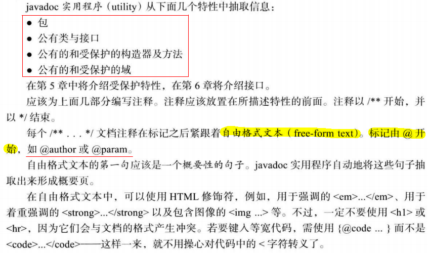

4.9.2 类注释

类注释必须放在`import`语句之后，类定义之前

```java
package com.ch04.PackageTest;

/**
 * test {@code}
 * @author Administrator
 *
 */
public class GenerateAnnotation {

}
```

```shell
D:\Eclipse Project\JavaCore\src\com\ch04\PackageTest>javadoc -d  PackageTest GenerateAnnotation.java
正在加载源文件GenerateAnnotation.java...
正在构造 Javadoc 信息...
正在创建目标目录: "PackageTest\"
标准 Doclet 版本 1.8.0_231
正在构建所有程序包和类的树...
正在生成PackageTest\com\ch04\PackageTest\GenerateAnnotation.html...
正在生成PackageTest\com\ch04\PackageTest\package-frame.html...
正在生成PackageTest\com\ch04\PackageTest\package-summary.html...
正在生成PackageTest\com\ch04\PackageTest\package-tree.html...
正在生成PackageTest\constant-values.html...
正在构建所有程序包和类的索引...
正在生成PackageTest\overview-tree.html...
正在生成PackageTest\index-all.html...
正在生成PackageTest\deprecated-list.html...
正在构建所有类的索引...
正在生成PackageTest\allclasses-frame.html...
正在生成PackageTest\allclasses-noframe.html...
正在生成PackageTest\index.html...
正在生成PackageTest\help-doc.html...
```

4.9.3 方法注释

```java
	/**
	 * Raises the salary of an employee
	 * @param byPercent the percentage by whick to raise the salary(e.g. 10 means 10%)
	 * @return the amount of the raise
	 */
	public double raiseSalary(double byPercent) {
		System.out.println("Hello World!");
		return 66.66;
	}
```


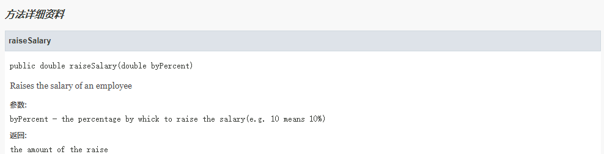

4.9.4 域注释

```java
	/**
	 * The "Hearts" card suit
	 */
	public static final int HEARTS = 1;
	
```

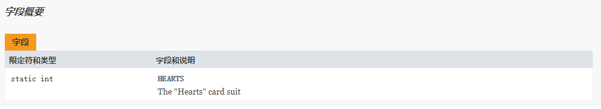

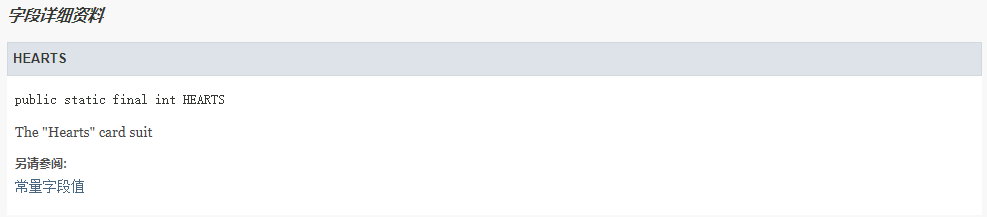

4.9.5 通用注释

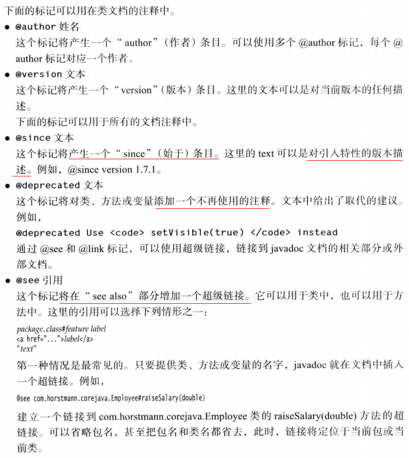

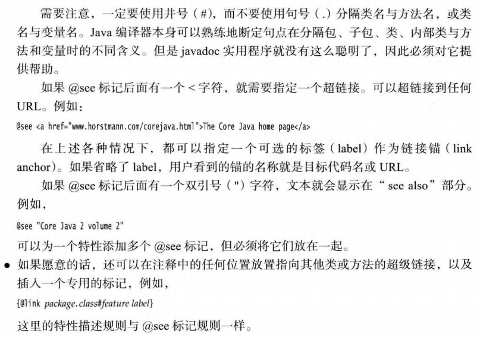

4.9.6 包与概述注释

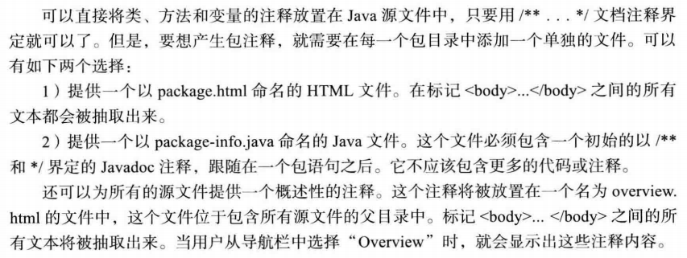

4.9.7 注释的抽取

- 详情见书

# 4.10 类设计技巧

1）一定要保证数据私有

- 绝对不要破坏封装性
- 编写：setter和getter

2）一定要对数据初始化

- 应显式初始化所有数据，最好不要依赖于系统的默认值
- 初始化方式
  - 声明时赋值
  - 构造器中赋值

3）不要在类中使用过多的基本类型

- 用其他类替代多个相关的基本类型使用，便于理解和易于修改，如：

  ```java
  private String street;
  private String city;
  private String state;
  private int zip;
  ```

  可用Address类封装

4）不是所有的域都需要独立的域访问器和域更改器

5）将职责过多的类进行分解

- 将复杂的类进行分解

6）类名和方法名要能体现它们的职责

命名习惯

- 类名
  - 采用一个名词，如：Order
  - 前有形容词修饰的名词，如：RushOrder
  - 前有动名词修饰的名词，如：BillingAddress
- 方法名
  - setter、getter用小写：set、get开头，如：setSalary、getSalary

7）优先使用不可变的类

- 类是不可变的，就可以安全地在多个线程间共享其对象

