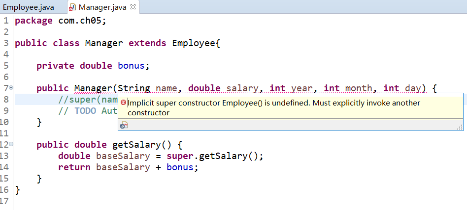
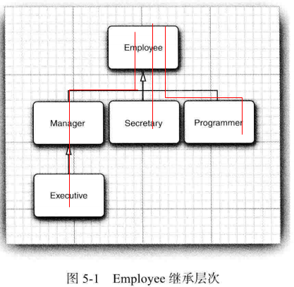
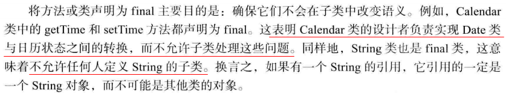
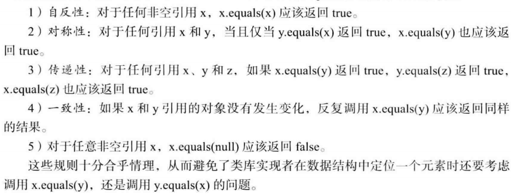
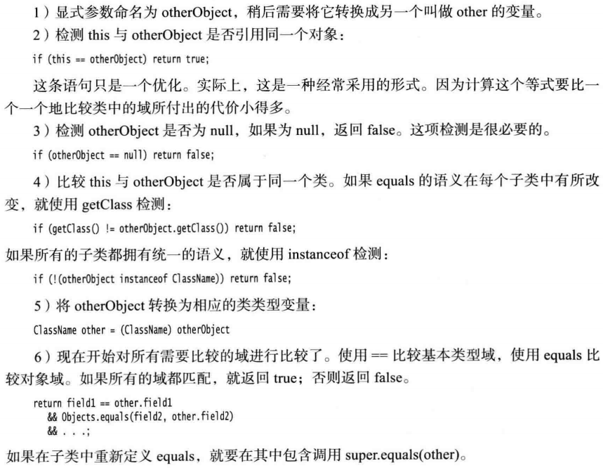
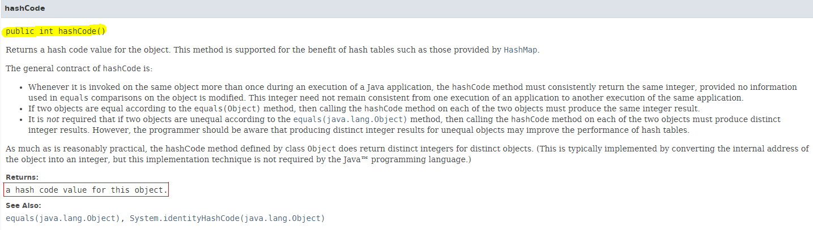
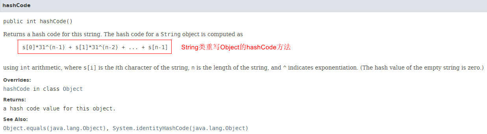
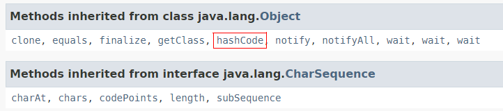

第4章主要内容：类和对象

本章主要内容：

继承（inheritance）

- 基于已有的类构造一个新类，复用（继承）原有类的方法和属性，就是继承

反射（reflection）

- 指在程序运行期间发现更多的类及其属性的能力

# 5.1 类、超类和子类

5.1.1 定义子类

1）继承中的术语

- 已存在的类：超类( **superclass**)、 基类（ **base** **class**) 或父类（**parent** **class**)
- 新类：子类（**subclass**) 、派生类**(** **derived** **class**) 或孩子类（**child** **class**)。

2）类设计思想

- 将通用的方法放在超类，将具有特殊用途的方法放在子类

5.1.2 覆盖方法

1）子类方法不能直接访问父类的私有属性，需要借助父类属性对应的getter

2）`super调用父类方法`：一个指示编译器调用超类方法的特殊关键字，不是一个对象的引用，不能将super赋给另一个对象变量

```java
public double getSalary() {
	double baseSalary = super.getSalary();// 获取父类私有属性salary
	return baseSalary + bonus;
}
```

5.1.3 子类构造器

1）`super调用父类构造器`：使用super 调用构造器的语句必须是子类构造器的第一条语句

2）如果子类的构造器没有显式地调用超类的构造器， 则将自动地调用超类默认（没有参数 )

的构造器。 **如果超类没有不带参数的构造器**， **并且在子类的构造器中又没有显式地调用超类**

**的==其他==构造器**则 Java 编译器将报告错误。



**3）多态【面试考点】**

> Q：谈一谈多态？
>
> A：Java中实现多态有两种方式：
>
> - 继承，子类重写父类的方法
> - 接口，类实现接口并重写接口中的方法
>
> 用父类和接口声明对象的引用变量，该变量能指向父类或子类，能指向实现类，这就是多态（polymorphism）。
>
> 在程序运行期间，能自动选择调用哪个方法（的动态绑定，dynamic binding），如：引用变量用父类声明，调用子类重写父类的同名方法时，若引用变量指向父类，调用父类的方法；若指向子类时调用子类的方法。


5.1.4 继承层次

1）继承层次（inheritance hierarchy）：由一个公共父类派生出来的**所有类的集合**被称为继承层次

2）继承链（inheritance chain）：从某个特定的类到其祖先的**路径**被称为该类的继承链

3）一个祖先类可以拥有多个子孙继承链



4）Java不支持多继承，但能用接口实现C++里多继承的功能

5.1.5 多态

1）"is a"：父类对象的任何地方都可以用子类对象置换

如：将一个子类的对象赋给超类变量

```java
Employee e; 
e = new Employee(. . .); // Employee object expected
e = new Manager(. . .); // OK, Manager can be used as well
```

再如：一个Employee变量既可以引用一个Employee类对象，也可以引用一个Employee类的任何一个子类的对象（如，Manager、Executive、Secretary等）

5.1.6 理解方法调用

1）方法覆盖

如果在子类中定义了一个与超类签名相同的方法， 那么子类中的这个方法就覆盖了超类中的这个相同签名的方法

2）动态绑定与方法表

虚拟机为 **Employee** 和 **Manager** 两个类生成方法表

Employee方法表：（省去了超类Object类的方法）


Manager方法表：


- 3个方法是**继承**来的：getName()、getSalary()、raiseSalary(double)
- 1个方法是**重写**的：getSalary()
- 1个是**新增**的：setBonus(double)

5.1.7 阻止继承：final类和方法

1）不允许类和方法被扩展，使用`final`修饰

```java
// final类:此类无法被继承
public final class Executive extend Manager{ 
    // final类的所有方法自动成为final方法
}

// final方法:子类不能覆盖此方法(getName())
public class Employee{
    ...
    public final String getName(){
        return name;
    }
    ...
}
```

2）将方法和类声明为final的主要目的：确保它们不会在子类中改变语义



5.1.8 强制类型转换

1）类型转换：将一个类型强制转换为另一个类型的过程被称为类型转换

2）✔：将一个子类的引用赋给一个超类变量，编译器允许（向上映射，自动转换）

​	  ✖：将一个超类的引用赋给一个子类变量，必须进行类型转换，这样才能通过运行时的检查（向下映射，必须强制转换）

3）`instanceof`：用于在类型转换之前，查看是否能够成功转换类型

```java
if (staff[1] instanceof Manager) {
	boss = (Manager)staff[1];
    ...
}
```

5.1.9 抽象类

1）抽象类包含：抽象方法、具体属性和具体方法

> 注意：
>
> - 类即使不含抽象方法，也可以将类声明为抽象类
>
> - 抽象类不能被实例化，即：一个类为abstract，那么不能对这个类创建类的对象
>
> - 可定义一个抽象类的对象变量，但它只能引用**非抽象子类的对象**
>
>   ```java
>   // p是抽象类Person的变量，Person引用了一个非抽象子类的Student的实例
>   Person p = new Student("Vince Vu", "Economics");
>   ```
>

```java
public abstract class Person{
	private String name;
	public Person(String name) {
		this.name = name ; 
    }
	public abstract String getDescription()；
	public String getName(){
        return name;
    }
}
```

2）抽象方法充当着占位的角色，它们的具体实现在子类中。扩展抽象类有两种选择：

- **子类**标记**为抽象**类，实现抽象类的部分方法，子类里依旧有抽象方法
- **子类非抽象**，实现全部的抽象方法

5.1.10 受保护访问

1）private属性，此属性只能在本类中访问，其他类都不可访问

​	  protected属性，此属性可被本类，同一包中其他类直接访问

2）protected方法，子类可使用此方法

**3）核心总结**：Java用于控制可见性的4个访问修饰符

- 仅对本类可见，private
- 对所有类可见，public
- 对本包和所有子类可见，protected
- 对本包课件，默认，无需修饰符

# 5.2 Object：所有类的超类

1）Java中，每个类都是由Objcet类扩展而来，是每个类的父类，则：可使用Object类型的变量引用任何类型的对象。如：

```java
Object obj = new Employee("Harry Hacker", 35000);
```

2）Java中，基本数据类型(primitive types)不是对象，例如：数值、字符和布尔类型的值都不是对象。其余的，如：数组类型、对象数组类型、基本数据类型的数组等，都是对象。

```java
Employee[] staff = new Employee[10];
obj = staff; // Object obj  Ok
obj = new int[10]; // OK
```

5.2.1 equals方法

1）Object类中，equals方法判断两个对象是否具有相同的引用（如果两个对象具有相同的引用，它们一定是相等的）

2）在**子类**中定义 equals 方法时， 首先调用超类的 equals。如果检测失败， 对象就不可能相

等。如果超类中的域都相等， 就需要比较子类中的实例域。

```java
public class Manager extends Employee{
	public boolean equals(Object otherObject) {
		if (!super.equals(otherObject)) return false; 
        // super.equals checked that this and otherObject belong to the same class
		Manager other = (Manager) otherObject;
		return bonus == other.bonus; 
	} 
}
```

5.2.2 相等测试与继承

1）Java语言规范要求equals方法具有下面的特性



**2）更完美的编写equals方法的建议**



5.2.3 hashCode方法

1）散列码（hash code）

- 是由对象导出的一个整形值，无规律
- Object类中定义了hashCode方法，因此每个对象都有一个默认的hashCode，值为：**对象的存储地址**。不同的对象hashCode不同。
  

2）String和StringBuilder的hashCode

```java
String s = "OK";
StringBuilder sb = new StringBuilder(s);
System.out.println("String: " + s.hashCode() + " StringBuilder: " + sb.hashCode());

String t = new String("OK");
StringBuilder tb = new StringBuilder(t);
System.out.println("String: " + t.hashCode() + " StringBuilder: " + tb.hashCode());

// 输出
String: 2524 StringBuilder: 366712642
String: 2524 StringBuilder: 1829164700
```

- 字符串s与t拥有相同的hashCode，因为：String的散列码是由**String内容导出的**
  

- 字符串缓冲sb与tb有不同的hashCode，因为：StringBuilder类没有重写Object的hashCode方法，其对象的散列码由Object类默认的hashCode方法导出对象的存储地址
  StringBuilder只继承Object的hashCode方法，未重写

  

3）自定义类的hashCode

- ==**【非常重要】**==

  equals与hashCode的定义必须一致：如果x.equals(y)返回true，那么x.hashCode()必须与y.hashCode()具有相同的值。例如， 如果用定义的 Employee.equals **比较雇员的 ID**，那 

  么 hashCode方法**就需要散列 ID**，而不是雇员的姓名或存储地址。

  如果重新定义equals方法，就必须重新定义hashCode方法，以便用户可以将对象插入到散列表中（第9章）

- hashCode()方法返回一个整型数值（可正 可负）

- 重写hashCode的几种方法

  - 空引用(null)不安全方法

    ```java
    public class Employee{
        public int hashCode(){
            return 7 * name.hashCode() + 11 * new Double(salary).hashCode() + 13 * hireDay.hashCode();
        }
    }
    ```

  - null安全的方法`Objects.hashCode`（单个参数）

    > 如果参数为null，这个方法会返回0，否则返回对参数调用hashCode的结果
    >
    > 如：Objects.hashCode(name) == null，最终结果返回0

    ```java
    public class Employee{
        public int hashCode(){
            return 7 * Objects.hashCode(name) + 11 * new Double(salary).hashCode() + 13 * Objects.hashCode(hireDay);
        }
    }
    ```

  - `Objects.hash(arg1, arg2...)`（多个参数，组合多个散列值）

    此方法基于`Objects.hashCode(arg)`编写，调用时会对各个参数调用`Objects.hashCode(arg)`，并组合这些散列值

    ```java
    public class Employee{
        public int hashCode(){
            return Objects.hash(name, salary, hireDay);
        }
    }
    ```

5.2.4 toString方法

1）概念

- Object.toString()：用于返回**表示对象值**的字符串

- 方法设计：getClass().getName()获得类名的字符串

  ```java
  public String toStringO
  {
  	return getClass().getName() + "[name=" + name
  				+ ",salary=" + salary + ",hireDay=" + hireDay +"]";
  }
  ```

2）子类中的toString()方法

如果超类使用了 getClass( ).getName( ), 那么子类只要调用 super.toString( )就可以

```java
public String toString() {
	return super.toString() + "[bonus=" + bonus + "]";
}
```

**3）toString()方法的自动调用【核心】**

- 只要对象与一个字符串通过操作符`+`连接起来，Java编译就会自动地调用toString方法，如：

  ```java
  Point p = new Point(10, 20);
  String message = "The current position is " + p;
  // automatically invokes p.toString()
  // String message = "The current position is " + p.toString();
  ```

- `x.toString()` 与 `"" + x`

  - x是对象时，两者相等
  - x是基本类型时，前者不能执行，后者依旧可执行

# 5.3 泛型数组列表

5.3.1 访问数组列表元素

5.3.2 类型化与原始数组列表的兼容性

# 5.4 对象包装器与自动装箱


# 5.5 参数数量可变的方法


# 5.6 枚举类


# 5.7 反射

5.7.1 Class类

5.7.2 捕获异常

5.7.3 利用反射分析类的能力

5.7.4 在运行时使用反射分析对象

5.7.5 使用反射编写泛型数组代码

5.7.6 调用任意方法

# 5.8 继承的设计技巧

