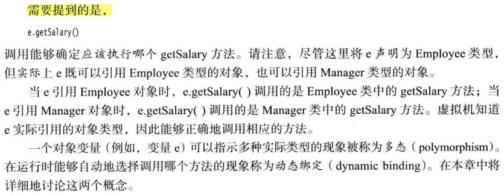

第4章主要内容：类和对象

本章主要内容：

继承（inheritance）

- 基于已有的类构造一个新类，复用（继承）原有类的方法和属性，就是继承

反射（reflection）

- 指在程序运行期间发现更多的类及其属性的能力

# 5.1 类、超类和子类

5.1.1 定义子类

1）继承中的术语

- 已存在的类：超类( **superclass**)、 基类（ **base** **class**) 或父类（**parent** **class**)
- 新类：子类（**subclass**) 、派生类**(** **derived** **class**) 或孩子类（**child** **class**)。

2）类设计思想

- 将通用的方法放在超类，将具有特殊用途的方法放在子类

5.1.2 覆盖方法

1）子类方法不能直接访问父类的私有属性，需要借助父类属性对应的getter

2）`super调用父类方法`：一个指示编译器调用超类方法的特殊关键字，不是一个对象的引用，不能将super赋给另一个对象变量

```java
public double getSalary() {
		double baseSalary = super.getSalary();// 获取父类私有属性salary
		return baseSalary + bonus;
}
```

5.1.3 子类构造器

1）`super调用父类构造器`：使用super 调用构造器的语句必须是子类构造器的第一条语句

2）如果子类的构造器没有显式地调用超类的构造器， 则将自动地调用超类默认（没有参数 )

的构造器。 **如果超类没有不带参数的构造器**， **并且在子类的构造器中又没有显式地调用超类**

**的其他构造器**则 Java 编译器将报告错误。


**3）多态【面试考点】**

> Q：谈一谈多态？
>
> A：Java中实现多态有两种方式：
>
> - 继承，子类重写父类的方法
> - 接口，类实现接口并重写接口中的方法
>
> 用父类和接口声明对象的引用变量，该变量能指向父类或子类，能指向实现类，这就是多态（polymorphism）。
>
> 在程序运行期间，能自动选择调用哪个方法（的动态绑定，dynamic binding），如：引用变量用父类声明，调用子类重写父类的同名方法时，若引用变量指向父类，调用父类的方法；若指向子类时调用子类的方法。



5.1.4 继承层次

1）继承层次（inheritance hierarchy）：由一个公共父类派生出来的**所有类的集合**被称为继承层次

2）继承链（inheritance chain）：从某个特定的类到其祖先的**路径**被称为该类的继承链

3）一个祖先类可以拥有多个子孙继承链


4）Java不支持多继承，但能用接口实现C++里多继承的功能

5.1.5 多态

1）"is a"：父类对象的任何地方都可以用子类对象置换

如：将一个子类的对象赋给超类变量

```java
Employee e; 
e = new Employee(. . .); // Employee object expected
e = new Manager(. . .); // OK, Manager can be used as well
```

再如：一个Employee变量既可以引用一个Employee类对象，也可以引用一个Employee类的任何一个子类的对象（如，Manager、Executive、Secretary等）

5.1.6 理解方法调用

1）方法覆盖

如果在子类中定义了一个与超类签名相同的方法， 那么子类中的这个方法就覆盖了超类中的这个相同签名的方法

2）动态绑定与方法表

虚拟机为 **Employee** 和 **Manager** 两个类生成方法表

Employee方法表：（省去了超类Object类的方法）


Manager方法表：


- 3个方法是继承来的：getName()、getSalary()、raiseSalary(double)
- 1个方法是重写的：getSalary()
- 1个是新增的：setBonus(double)

5.1.7 阻止继承：final类和方法

1）不允许类和方法被扩展，使用`final`修饰

```java
// final类:此类无法被继承
public final class Executive extend Manager{ 
    // final类的所有方法自动成为final方法
}

// final方法:子类不能覆盖此方法(getName())
public class Employee{
    ...
    public final String getName(){
        return name;
    }
    ...
}
```

2）将方法和类声明为final的主要目的：确保它们不会在子类中改变语义


5.1.8 强制类型转换

1）类型转换：将一个类型强制转换为另一个类型的过程被称为类型转换


5.1.9 抽象类

5.1.10 受保护访问

# 5.2 Object：所有类的超类

5.2.1 equals方法

5.2.2 相等测试与继承

5.2.3 hashCode方法

5.2.4 toString方法

# 5.3 泛型数组列表

5.3.1 访问数组列表元素

5.3.2 类型化与原始数组列表的兼容性

# 5.4 对象包装器与自动装箱


# 5.5 参数数量可变的方法


# 5.6 枚举类


# 5.7 反射

5.7.1 Class类

5.7.2 捕获异常

5.7.3 利用反射分析类的能力

5.7.4 在运行时使用反射分析对象

5.7.5 使用反射编写泛型数组代码

5.7.6 调用任意方法

# 5.8 继承的设计技巧

