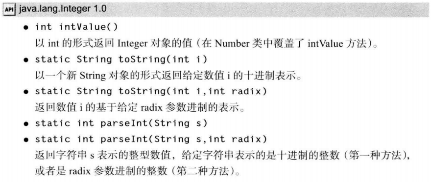
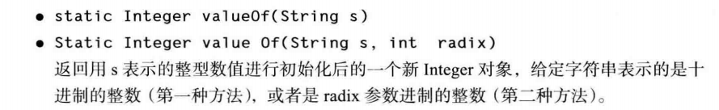
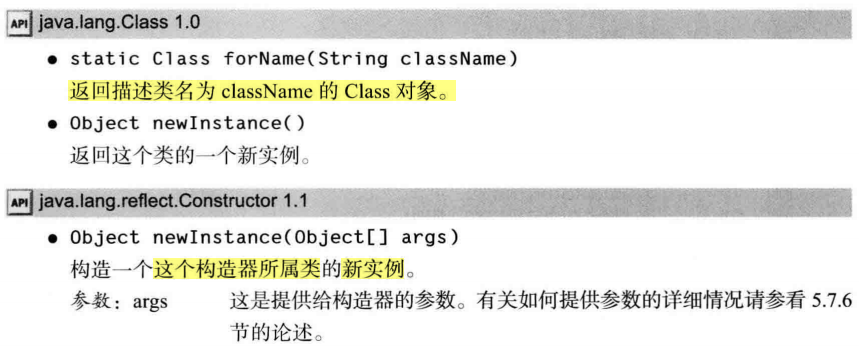
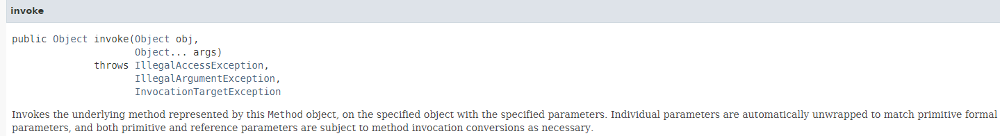
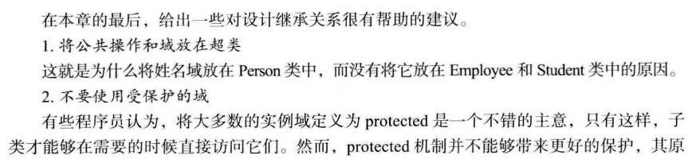
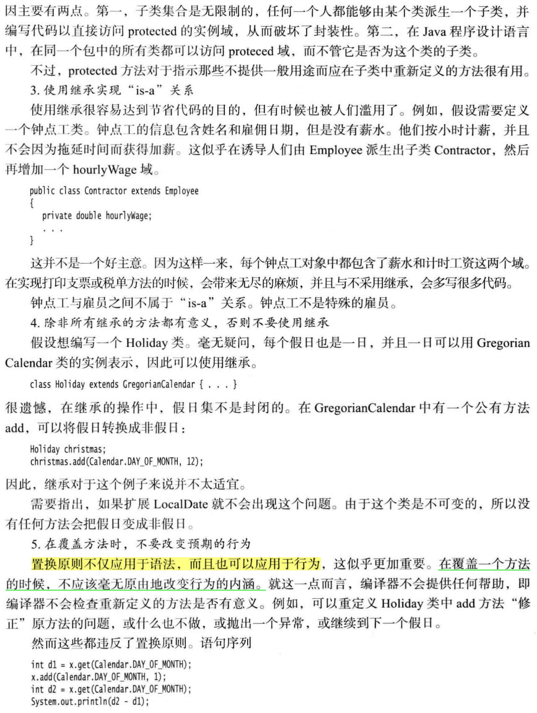
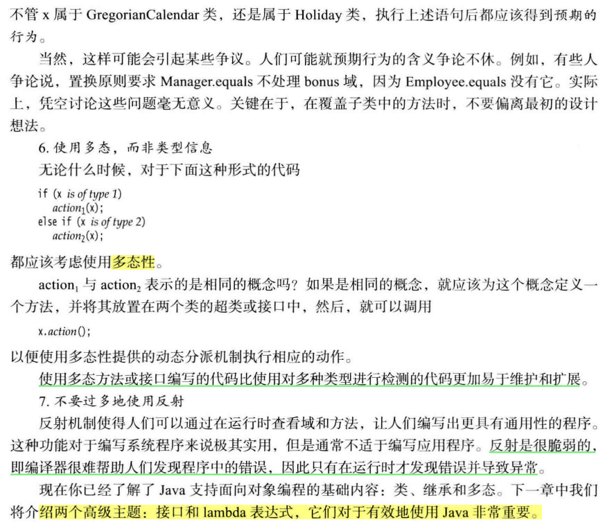

第4章主要内容：类和对象

本章主要内容：

继承（inheritance）

- 基于已有的类构造一个新类，复用（继承）原有类的方法和属性，就是继承

反射（reflection）

- 指在程序运行期间发现更多的类及其属性的能力

# 5.1 类、超类和子类

5.1.1 定义子类

1）继承中的术语

- 已存在的类：超类( **superclass**)、 基类（ **base** **class**) 或父类（**parent** **class**)
- 新类：子类（**subclass**) 、派生类**(** **derived** **class**) 或孩子类（**child** **class**)。

2）类设计思想

- 将通用的方法放在超类，将具有特殊用途的方法放在子类

5.1.2 覆盖方法

1）子类方法不能直接访问父类的私有属性，需要借助父类属性对应的getter

2）`super调用父类方法`：一个指示编译器调用超类方法的特殊关键字，不是一个对象的引用，不能将super赋给另一个对象变量

```java
public double getSalary() {
	double baseSalary = super.getSalary();// 获取父类私有属性salary
	return baseSalary + bonus;
}
```

5.1.3 子类构造器

1）`super调用父类构造器`：使用super 调用构造器的语句必须是子类构造器的第一条语句

2）如果子类的构造器没有显式地调用超类的构造器， 则将自动地调用超类默认（没有参数 )

的构造器。 **如果超类没有不带参数的构造器**， **并且在子类的构造器中又没有显式地调用超类**

**的==其他==构造器**则 Java 编译器将报告错误。


**3）多态【面试考点】**

> Q：谈一谈多态？
>
> A：Java中实现多态有两种方式：
>
> - 继承，子类重写父类的方法
> - 接口，类实现接口并重写接口中的方法
>
> 用父类和接口声明对象的引用变量，该变量能指向父类或子类，能指向实现类，这就是多态（polymorphism）。
>
> 在程序运行期间，能自动选择调用哪个方法（的动态绑定，dynamic binding），如：引用变量用父类声明，调用子类重写父类的同名方法时，若引用变量指向父类，调用父类的方法；若指向子类时调用子类的方法。


5.1.4 继承层次

1）继承层次（inheritance hierarchy）：由一个公共父类派生出来的**所有类的集合**被称为继承层次

2）继承链（inheritance chain）：从某个特定的类到其祖先的**路径**被称为该类的继承链

3）一个祖先类可以拥有多个子孙继承链


4）Java不支持多继承，但能用接口实现C++里多继承的功能

5.1.5 多态

1）"is a"：父类对象的任何地方都可以用子类对象置换

如：将一个子类的对象赋给超类变量

```java
Employee e; 
e = new Employee(. . .); // Employee object expected
e = new Manager(. . .); // OK, Manager can be used as well
```

再如：一个Employee变量既可以引用一个Employee类对象，也可以引用一个Employee类的任何一个子类的对象（如，Manager、Executive、Secretary等）

5.1.6 理解方法调用

1）方法覆盖

如果在子类中定义了一个与超类签名相同的方法， 那么子类中的这个方法就覆盖了超类中的这个相同签名的方法

2）动态绑定与方法表

虚拟机为 **Employee** 和 **Manager** 两个类生成方法表

Employee方法表：（省去了超类Object类的方法）


Manager方法表：


- 3个方法是**继承**来的：getName()、getSalary()、raiseSalary(double)
- 1个方法是**重写**的：getSalary()
- 1个是**新增**的：setBonus(double)

5.1.7 阻止继承：final类和方法

1）不允许类和方法被扩展，使用`final`修饰

```java
// final类:此类无法被继承
public final class Executive extend Manager{ 
    // final类的所有方法自动成为final方法
}

// final方法:子类不能覆盖此方法(getName())
public class Employee{
    ...
    public final String getName(){
        return name;
    }
    ...
}
```

2）将方法和类声明为final的主要目的：确保它们不会在子类中改变语义


5.1.8 强制类型转换

1）类型转换：将一个类型强制转换为另一个类型的过程被称为类型转换

2）✔：将一个子类的引用赋给一个超类变量，编译器允许（向上映射，自动转换）

​	  ✖：将一个超类的引用赋给一个子类变量，必须进行类型转换，这样才能通过运行时的检查（向下映射，必须强制转换）

3）`instanceof`：用于在类型转换之前，查看是否能够成功转换类型

```java
if (staff[1] instanceof Manager) {
	boss = (Manager)staff[1];
    ...
}
```

5.1.9 抽象类

1）抽象类包含：抽象方法、具体属性和具体方法

> 注意：
>
> - 类即使不含抽象方法，也可以将类声明为抽象类
>
> - 抽象类不能被实例化，即：一个类为abstract，那么不能对这个类创建类的对象
>
> - 可定义一个抽象类的对象变量，但它只能引用**非抽象子类的对象**
>
>   ```java
>   // p是抽象类Person的变量，Person引用了一个非抽象子类的Student的实例
>   Person p = new Student("Vince Vu", "Economics");
>   ```
>

```java
public abstract class Person{
	private String name;
	public Person(String name) {
		this.name = name ; 
    }
	public abstract String getDescription()；
	public String getName(){
        return name;
    }
}
```

2）抽象方法充当着占位的角色，它们的具体实现在子类中。扩展抽象类有两种选择：

- **子类**标记**为抽象**类，实现抽象类的部分方法，子类里依旧有抽象方法
- **子类非抽象**，实现全部的抽象方法

5.1.10 受保护访问

1）private属性，此属性只能在本类中访问，其他类都不可访问

​	  protected属性，此属性可被本类，同一包中其他类直接访问

2）protected方法，子类可使用此方法

**3）核心总结**：Java用于控制可见性的4个访问修饰符

- 仅对本类可见，private
- 对所有类可见，public
- 对本包和所有子类可见，protected
- 对本包课件，默认，无需修饰符

# 5.2 Object：所有类的超类

1）Java中，每个类都是由Objcet类扩展而来，是每个类的父类，则：可使用Object类型的变量引用任何类型的对象。如：

```java
Object obj = new Employee("Harry Hacker", 35000);
```

2）Java中，基本数据类型(primitive types)不是对象，例如：数值、字符和布尔类型的值都不是对象。其余的，如：数组类型、对象数组类型、基本数据类型的数组等，都是对象。

```java
Employee[] staff = new Employee[10];
obj = staff; // Object obj  Ok
obj = new int[10]; // OK
```

5.2.1 equals方法

1）Object类中，equals方法判断两个对象是否具有相同的引用（如果两个对象具有相同的引用，它们一定是相等的）

2）在**子类**中定义 equals 方法时， 首先调用超类的 equals。如果检测失败， 对象就不可能相

等。如果超类中的域都相等， 就需要比较子类中的实例域。

```java
public class Manager extends Employee{
	public boolean equals(Object otherObject) {
		if (!super.equals(otherObject)) return false; 
        // super.equals checked that this and otherObject belong to the same class
		Manager other = (Manager) otherObject;
		return bonus == other.bonus; 
	} 
}
```

5.2.2 相等测试与继承

1）Java语言规范要求equals方法具有下面的特性


**2）更完美的编写equals方法的建议**


5.2.3 hashCode方法

1）散列码（hash code）

- 是由对象导出的一个整形值，无规律
- Object类中定义了hashCode方法，因此每个对象都有一个默认的hashCode，值为：**对象的存储地址**。不同的对象hashCode不同。
  

2）String和StringBuilder的hashCode

```java
String s = "OK";
StringBuilder sb = new StringBuilder(s);
System.out.println("String: " + s.hashCode() + " StringBuilder: " + sb.hashCode());

String t = new String("OK");
StringBuilder tb = new StringBuilder(t);
System.out.println("String: " + t.hashCode() + " StringBuilder: " + tb.hashCode());

// 输出
String: 2524 StringBuilder: 366712642
String: 2524 StringBuilder: 1829164700
```

- 字符串s与t拥有相同的hashCode，因为：String的散列码是由**String内容导出的**
  

- 字符串缓冲sb与tb有不同的hashCode，因为：StringBuilder类没有重写Object的hashCode方法，其对象的散列码由Object类默认的hashCode方法导出对象的存储地址
  StringBuilder只继承Object的hashCode方法，未重写

  

3）自定义类的hashCode

- ==**【非常重要】**==

  equals与hashCode的定义必须一致：如果x.equals(y)返回true，那么x.hashCode()必须与y.hashCode()具有相同的值。例如， 如果用定义的 Employee.equals **比较雇员的 ID**，那 

  么 hashCode方法**就需要散列 ID**，而不是雇员的姓名或存储地址。

  如果重新定义equals方法，就必须重新定义hashCode方法，以便用户可以将对象插入到散列表中（第9章）

- hashCode()方法返回一个整型数值（可正 可负）

- 重写hashCode的几种方法

  - 空引用(null)不安全方法

    ```java
    public class Employee{
        public int hashCode(){
            return 7 * name.hashCode() + 11 * new Double(salary).hashCode() + 13 * hireDay.hashCode();
        }
    }
    ```

  - null安全的方法`Objects.hashCode`（单个参数）

    > 如果参数为null，这个方法会返回0，否则返回对参数调用hashCode的结果
    >
    > 如：Objects.hashCode(name) == null，最终结果返回0

    ```java
    public class Employee{
        public int hashCode(){
            return 7 * Objects.hashCode(name) + 11 * new Double(salary).hashCode() + 13 * Objects.hashCode(hireDay);
        }
    }
    ```

  - `Objects.hash(arg1, arg2...)`（多个参数，组合多个散列值）

    此方法基于`Objects.hashCode(arg)`编写，调用时会对各个参数调用`Objects.hashCode(arg)`，并组合这些散列值

    ```java
    public class Employee{
        public int hashCode(){
            return Objects.hash(name, salary, hireDay);
        }
    }
    ```

5.2.4 toString方法

1）概念

- Object.toString()：用于返回**表示对象值**的字符串

- 方法设计：getClass().getName()获得类名的字符串

  ```java
  public String toStringO
  {
  	return getClass().getName() + "[name=" + name
  				+ ",salary=" + salary + ",hireDay=" + hireDay +"]";
  }
  ```

2）子类中的toString()方法

如果超类使用了 getClass( ).getName( ), 那么子类只要调用 super.toString( )就可以

```java
public String toString() {
	return super.toString() + "[bonus=" + bonus + "]";
}
```

**3）toString()方法的自动调用【核心】**

- 只要对象与一个字符串通过操作符`+`连接起来，Java编译就会自动地调用toString方法，如：

  ```java
  Point p = new Point(10, 20);
  String message = "The current position is " + p;
  // automatically invokes p.toString()
  // String message = "The current position is " + p.toString();
  ```

- `x.toString()` 与 `"" + x`

  - x是对象时，两者相等
  - x是基本类型时，前者不能执行，后者依旧可执行

# 5.3 泛型数组列表

1）ArrayList是一个采用类型参数（type parameter）的泛型类（generic class）

```java
ArrayList<Employee> staff = new ArrayList<Employee>();
// “菱形语法”：Java 7及之后，可以省去右边的类型参数
// 编译器自动填充<>内的类型
ArrayList<Employee> staff = new ArrayList<>();
```

2）数组列表ArrayList与数组

- 数组列表：自由控制数组的大小，可一开始确定列表大小，也可自动扩增
- 数组：大小定义时就确定

```java
// 数组列表
ArrayList<Employee> staff = new ArrayList<>();
staff.add(new Employee("Carl Cracker", 75000, 1987, 12, 15));
staff.add(new Employee("Harry Hacker", 50000, 1989, 10, 1));
staff.add(new Employee("Tony Tester", 40000, 1990, 3, 15));

// 数组
Employee[] arr = new Employee[staff.size()];
staff.toArray(arr);
```

5.3.1 访问数组列表元素

1）ArrayList和`ArrayList<Employee>`

- 前者：内部全是Object类型对象
- 后者：内部是Employee类型对象

2）ArrayList特点

- 插入和删除元素操作效率比较低
  - 小型数组，效率一般
  - 大型数组，效率低

5.3.2 类型化与原始数组列表的兼容性

原始代码

```java
public class EmployeeDB{
    public void update(ArrayList list){...}
    public ArrayList find(String query){...}
}
```

兼容代码：

```java
// 版本1：不太安全的做法
ArrayList<Employee> staff = ...;
employeeDB.update(staff);

// 版本2：warning的做法（推荐）
ArrayList<Employee> result = employeeDB.find(query);
```

# 5.4 对象包装器与自动装箱

1）自动装箱与自动拆箱

```java
ArrayList<Integer> list = new ArrayList<>();
list.add(3);   // int -> Integer。自动变为：list.add(Integer.valueOf(3));
int n = list.get(0);// Integer -> int。自动变为：int n = list.get(0).intValue();
```

2）装箱比较

```java
Integer a = 1000;
Integer b = 1000;
System.out.println(a == b); // false，只比较对象的存储区域引用（地址）
```

3）**混合运算**自动装箱

```java
// 混合运算自动装箱
Integer n2 = 1;
Double x2 = 2.0;
System.out.println(n2 * x2);// Integer自动拆箱，提升为double，再装箱为Double
```

4）字符串转为数值

```java
int x = Integer.parseInt("123");// x = 123;
```

5）Integer类的常用方法





# 5.5 参数数量可变的方法

**变参方法**：定义方法时，方法的参数数量可不固定，可变

1）printf方法

```java
public class PrintStream{
    // printf方法接收两个参数：一个是格式字符串，另一个是Object[]数组
    // 第i个格式说明符与arg[i]的值匹配
    // Object... 等价于 Object[]
	public PrintStream printf(String fmt , Object... args) { 
        return format(fmt, args); 
	} 
}
```

测试

```java
System.out.printf("%d %s",new Object[] {new Integer(3), "widgets"});
System.out.printf("%d %s", 3, "widgets");
System.out.printf("%d %s", Integer.valueOf(3), "widgets");

// 输出
3 widgets
3 widgets
3 widgets
```

2）自定义变参方法

```java
// 变参: double...
public static double max(double... values) {
    double largest = Double.NEGATIVE_INFINITY;
    System.out.println(largest);
    for(double v : values) {
        if (v > largest) {
            largest = v;
        }
    }
    return largest;
}

public static void main(String[] args) {
    double m = max(3.1, 40.4, -5);
    System.out.println(m); // 40.4
}
```

# 5.6 枚举类

1）枚举类型是一种特殊的类，其内部的枚举常量是对应的实例对象，因此：尽量不要用枚举类构造新对象（不能直接new）

2）枚举类中可有：构造器、方法和属性。构造器只在构造枚举常量时被调用

```java
enum Size {
	SMALL("S"), MEDIUM("M"), LARGE("L"), EXTRA_LARGE("XL");

	private String abbreviation;

	private Size(String abbreviation) {
		this.abbreviation = abbreviation;
	}

	public String getAbbreviation() {
		return abbreviation;
	}
}

public class EnumTest {

	public static void main(String[] args) {
		// TODO Auto-generated method stub
		Scanner in = new Scanner(System.in);
		System.out.println("Enter a size: (SMALL, MEDIUM, LARGE, EXTRA_LARCE) ");
		String input = in.next().toUpperCase();
        // static Enum valueOf(Class enumClass , String name )
        // 返回指定名字、给定类的枚举常量。
		Size size = Enum.valueOf(Size.class, input);
		System.out.println("abbreviation=" + size.getAbbreviation());
		if(size == Size.EXTRA_LARGE) {
			System.out.println("Good job you paid attention to the _.");
		}
	}
}

// 输出
Enter a size: (SMALL, MEDIUM, LARGE, EXTRA_LARCE) 
extra_large
abbreviation=XL
Good job you paid attention to the _.
```

# 5.7 反射

1）反射库（reflection library）提供了一个非常丰富且精细设计的工具集，以便能够**动态操纵**Java代码程序。

2）反射（reflective）：能够分析类能力的程序称为反射。反射机制的功能：

- 在运行时分析类的能力
- 在运行时查看对象，例如：编写一个toString方法供所有类使用
- 实现通用的数组操作代码
- 利用Method对象（此对象类似C++中函数指针）

5.7.1 Class类

1）程序运行时，系统始终**对所有对象**维护一个：运行时类型信息，其跟踪着每个对象所属的类。虚拟机可利用：运行时类型信息选择相应的方法执行。

2）保存**对象运行时类型信息**的类为：Class类，Class类型的实例可通过3种方式获得：

- `instance.getClass();`
- `Class.forName("className");`
- `Class.class`

示例：

```java
// reflection test
// method1: create class object by instance
Employee e = new Employee("zhangsan", 66666, 1999, 6, 6);
Class  c1 = e.getClass(); // 
System.out.println(c1.getName() + " " + e.getName());

// method2: create class object by Class.forName(str);
String className = "java.util.Random";
Class c2 = Class.forName(className); // 
System.out.println(c2.getName());

// method3: create class object by Class.class
Class c3 = Random.class;
Class c4 = int.class; // int不是类，但也可以获取其对应的Class对象
Class c5 = Double[].class;
System.out.println(c3.getName());
System.out.println(c4.getName());
System.out.println(c5.getName());
```

3）Class类**本质**是一个泛型类

```java
// Employee.class 本质是 Class<Employee>
Class c = Employee.class;
// 等价于
Class<Employee> c = Employee.class;
```

4）虚拟机为每个类型管理一个Class对象，即：一个类型只有一个Class对象

```java
Employee e = new Employe(xx);
e.getClass() == Employee.class // true
```

5）可通过Class对象动态创建类的实例。

```java
// 创建了一个与 e 具有相同类类型的实例
// newlnstance方法调用默认的构造器（没有参数的构造器）初始化新创建的对象。
e.getClass().newInstance();
```

5.7.2 捕获异常

1）Java中异常有两种类型：

- 未检查异常：编译器不会查看是否为这些错误提供了处理器
- 已检查异常：编译器会查看是否提供了异常处理器

2）方法介绍



5.7.3 **利用反射分析类**的能力

1）java.lang.reflect有3个类：`Field`、`Method`、`Constructor`分别用于描述类的：属性、方法和构造器。这3个类共有的方法：

- getName()：返回项目名称
- getModifiers()：返回整形值，代表`public`、`static`等修饰符使用情况

2）Modifiers类中有：

- isPublic、isPrivate、isFinal判断方法或构造器是否是public、private或final

5.7.4 在运行时**使用反射分析对象**

1）AccessibleObject类是：Field、Method和Constructor类的公共超类，`setAccessible`方法可将属性设置为可访问。

```java
f.setAtcessible(true); // now OK to call f.get(harry);

Employee harry = new Employee("Harry Hacker", 35000, 10, 1, 1989);

// the class object representing Employee
Class cl = harry.getClass();
    
// the name field of the Employee class
Field f = cl .getDeclaredField("name");

// the value of the name field of the harry object , i.e., the String object "Harry Hacker"
Object v = f.get(harry); 
```

5.7.5 **使用反射编写泛型数组**代码

需要时翻阅学习！

5.7.6 调用任意方法【**重点：回调函数invoke**】

1）C/C++，可通过函数指针执行任意函数，即：将一个方法的存储地址传给一个方法，第二个方法可以调用第一个方法。Java中未使用函数指针，提供了两种类似的解决方案：

- 接口（interface）

- 反射机制中的：invoke

  ```java
  method.invoke(instance); // 通过: 方法名.invoke(对象); 调用该对象的方法
  
  // m1代表Employee类的getName()方法
  String n = (String)m1.invoke(harry); // 调用对象harry的getName()方法
  ```

2）`Method.invoke()`特性（**回调函数invoke**的特性）




**invoke（调用）是Method类的代表方法，可以实现动态调用对象方法**。

特性：

- 参数和返回值必须是Object类型，意味着：必须进行多次的类型转换。
- 使用反射获得方法指针的代码（invoke）比直接调用方法明显慢一些

建议：

- 仅在必要的时候使用`Method.invoke(Object obj, Object... args)`，即：**Method对象的回调**功能。
- 使用接口进行回调会使得代码的执行速度更快，更易于维护

3）如何使用Method.invoke？

- step1 先获得Method对象（也可以说：**获得方法指针**）

  ```java
  Method m1 = Employee.class.getMethod("getName");// 获得getName()方法指针
  Method m2 = Employee.class.getMethod("rasiseSalary", double.class);
  ```

- step2  使用方法

  ```java
  m1.invoke(harry); // 执行实例对象harry的getName()方法
  ```

实例：

```java
package com.ch05.methods;

import java.lang.reflect.Method;

public class MethodTableTest {

	public static void main(String[] args) throws NoSuchMethodException, SecurityException {
		// TODO Auto-generated method stub
		// get method pointers to the square and sqrt methods
		Method square = MethodTableTest.class.getMethod("square", double.class);
		Method sqrt = Math.class.getMethod("sqrt", double.class);
		
		// print tables of x- and y-values
		printTable(1, 10, 10, square);
		printTable(1, 10, 10, sqrt);
	}
	
	/**
	 * Returns the square of a number
	 */
	public static double square(double x) {
		return x * x;
	}
	
	/**
	 * Prints a table with x- and y-values for a method
	 */
	public static void printTable(double from, double to, int n, Method f) {
		// print out the method as table header
		System.out.println("f = " + f);
		
		double dx = (to - from) / (n - 1);
		
		for(double x = from; x <= to; x += dx) {
			try {
				// 回调方法使用
				double y = (Double) f.invoke(null, x);
				System.out.printf("%10.4f | %10.4f%n", x, y);
			} catch (Exception e) {
				// TODO: handle exception
				e.printStackTrace();
			}
		}
	}
}

// 输出
f = public static double com.ch05.methods.MethodTableTest.square(double)
    1.0000 |     1.0000
    2.0000 |     4.0000
    3.0000 |     9.0000
    4.0000 |    16.0000
    5.0000 |    25.0000
    6.0000 |    36.0000
    7.0000 |    49.0000
    8.0000 |    64.0000
    9.0000 |    81.0000
   10.0000 |   100.0000
f = public static double java.lang.Math.sqrt(double)
    1.0000 |     1.0000
    2.0000 |     1.4142
    3.0000 |     1.7321
    4.0000 |     2.0000
    5.0000 |     2.2361
    6.0000 |     2.4495
    7.0000 |     2.6458
    8.0000 |     2.8284
    9.0000 |     3.0000
   10.0000 |     3.1623
```

# 5.8 继承的设计技巧





