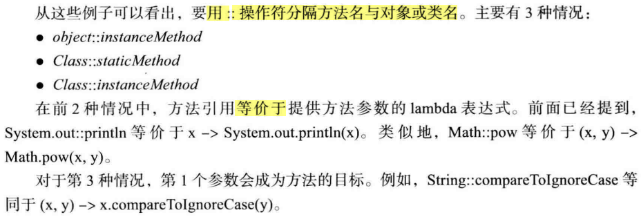
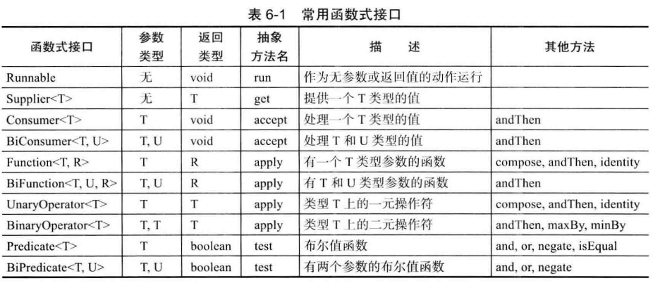
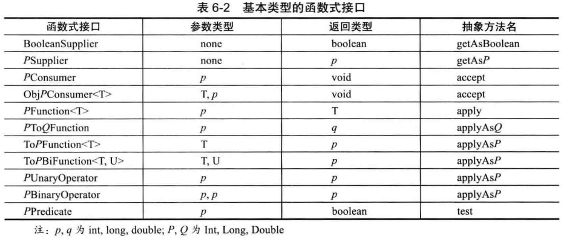
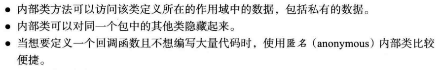
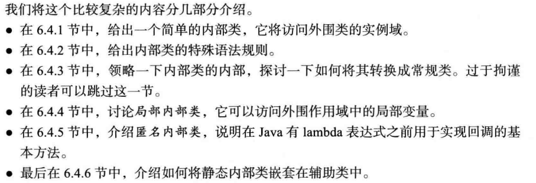
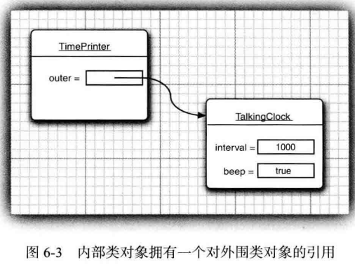
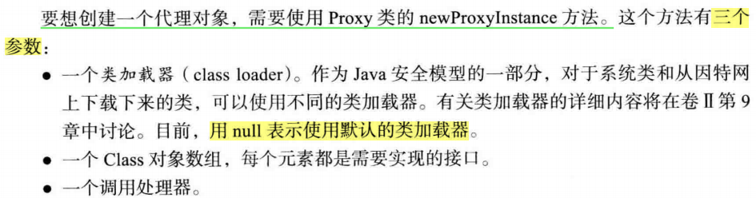

本章内容

1）接口（interface）：主要用于描述类具有什么功能，而并不给出每个功能的具体实现。一个类可以实现（implement）一个或多个接口，并在需要接口的地方，随时使用实现了相应接口的对象。

2）lambda表达式：一种表示可以在将来某个时间点执行的代码块的简洁方法，可以用一种精巧而简洁的方式表示**使用回调或变量行为的代码**。

3）内部类（inner class）：内部类定义在另一个类的内部，其中的方法可以访问包含它们的外部类的域。主要用于设计具有相互协作关系的类集合。

4）代理（proxy）：一种实现任意接口的对象，是一种非常专业的构造工具，用来构建系统级的工具。

# 6.1 接口

6.1.1 接口概念

1）概念

Q：什么是接口？

A：如果类遵从某个特定接口，那么就履行这项服务。具体来说，类实现某个接口，就必须实现接口所定义的方法，遵从接口里方法的：方法名、参数列表、返回值。

2）Comparable接口

```java
// Java 5之前原型
public interface Comparable{
    int compareTo(Object o);
}

// Java 5后接口改为泛型类型
public interface Comparable<T>{
    int compareTo(T o);// parameter has type T
}
```

- 在调用`x.compareTo(y) `的时候，这个compareTo 方法**必须确实比较两个对象的内容**， 并返回一个整型数值。
  - 当 x 小于 y 时， 返回一个负数；
  - 当 x 等于 y 时， 返回 0; 
  - 否则返回一个正数。

3）接口的默认属性【核心内容】

- 接口中所有方法自动地属于`public`。在接口中声明方法时，不必提供关键字public，但在类实现接口时，必须把方法声明为`public`，否则，编译器会认为这个方法的访问属性是：包可见，即：类的默认访问属性，编译器报错，如下图：

  

- 接口中不能有属性；接口不能实例化。

  > 可以将接口看成没有实例域的抽象类

4）API介绍

- 接口Comparable默认的compareTo方法返回的是一个**整型数值**
  

- 实现Comparable接口的包装类

  

- Arrays.sort()

  

6.1.2 接口的特性

1）接口不能实例化，但可声明接口变量，接口变量必须引用实现了接口的类对象

```java
class Employee implements Comparable<Employee>{
    ...
}

Comparable<Employee> x = new Employee("zhangsan", 666);
```

2）instanceof

- 检查一个**对象是否属于某个特定的类**

- 检查一个**对象是否实现了某个特定的接口**

  ```java
  Employee[] staff = new Employee[3];
  		
  staff[0] = new Employee("Harry Hacker", 35000);
  staff[1] = new Employee("Carl Cracker", 75000);
  staff[2] = new Employee("Tony Tester", 38000);
  
  if(staff[0] instanceof Comparable) {
      System.out.println("true"); // true
  }
  ```

3）接口中可有：

- 方法：public

- 常量：public static final

  ```java
  // 常量可在实现接口的类中直接调用
  interface Moveable{
  	void move(double x, double y);
  }
  
  interface Powered extends Moveable{
      double SPEED_LIMIT = 95; // a public static final constant
      double milesPerGallon();
  }
  
  class A implements Powered{
  
      @Override
      public void move(double x, double y) {
      }
  
      @Override
      public double milesPerGallon() {
          return 0;
      }
  }
  
  System.out.println(new A().SPEED_LIMIT); // 95.0
  ```

4）接口可以被扩展，即：接口可以继承接口

6.1.3 接口与抽象类

Q：为什么不将Comparable接口设计成为抽象类？

A：Java中每个类只能扩展一个类，但可以实现多个接口。

假设Employee 类已经扩展了一个类， 例如Person, 它就不能再像下面这样扩展第二个类了

```java
class Employee extends Person, Comparable // error
```

但，可以实现多个接口

```java
class Employee extends Person implements Comparable // ok
```

6.1.4 静态方法

1）Java 8中，允许接口中增加静态方法。但这样违背了将接口作为抽象规范的初衷。

之前的做法，将静态方法放在伴随类中，如：在标准库中，有**成对出现的接口和实用工具类**，如：Collection/Collections、Path/Paths


6.1.5 默认方法

可以为接口方法提供一个默认实现，必须用`default`修饰符西标记这样一个方法

```java
public interface Comparable<T>{
    // By default, all the elements are the same
    default int compareTo(T other){return 0;}
}
```

上述操作并没有太大用处，因为Comparable每个实现类都要覆盖这个方法，有用处的地方在于：

- Java Swing事件中，如：鼠标点击事件方法默认值
- 在Java 8中为某个接口添加了新方法，但此接口**所有实现类**中都需要实现此方法，费时费力，可使用默认方法解决此问题。

6.1.6 解决默认方法冲突

一个类实现2个接口或实现1个接口个1个类，有可能存在方法名命名冲突，Java中提供了两种解决方案。

1）接口冲突。如果一个超接口提供了一个默认方法，另一个接口提供了一个同名而且参数类型（不论是否是默认参数）相同的方法， **必须覆盖这个方法**来解决冲突。

```java
class Student implements Person, Named{
    public String getName(){
        return Person.super.getName(); // 使用Person中的方法
    }
}
```

2）超类优先。如果超类提供了一个**具体方法**，同名而且有相同参数类型的默认方法会被忽略。

```java
class Student extends Person implements Named{
    ...
}
```

# 6.2 接口示例

6.2.1 接口与回调

回调（callback）是一种常见的程序设计模式，可以指出某个特定事件发生时应该采取的动作。

6.2.2 Comparator接口

1）当自带的`java.lang.Comparable`接口无法满足新的排序需求时，可用外部比较器（`java.util.Comparator`）实现新的排序需求。

2）两个接口使用对比

使用Comparable接口前提：

- **类对象数组**需要排序，则**类**必须实现Comparable接口

使用Comparator接口：

- 新建一个比较器类，并实现Comparator接口。实例化一个比较器对象，用于排序

  ```java
  public class ComparatorTest {
  
  	public static void main(String[] args) {
  		// 外部比较器对象
  		Comparator<String> comp = new LengthComparator();
          // 单独比较
  		System.out.println(comp.compare("123", "3456"));
  		// 对象数组比较
  		String[] str = {"123,", "332432", "1"};
  		Arrays.sort(str, comp);
          // print
  		for (String string : str) {
  			System.out.print(string + " ");
  		}
  	}
  }
  
  class LengthComparator implements Comparator<String>{
  	@Override
  	public int compare(String o1, String o2) {
  		// TODO Auto-generated method stub
  		return o1.length() - o2.length();
  	}
  }
  ```

6.2.3 对象克隆

1）普通的为一个**包含对象引用的变量**建立副本时，直接进行引用的赋值，原变量和副本都是同一个对象的引用。任何一个变量改变都会影响另一个变量。

```java
Employee original = new Employe("John Public", 50000);
Employee copy = original;
copy.raiseSalary(10); // oops--also changed original
```


如果希望copy是一个新对象，它的初始状态与original相同，但之后它们各自会有自己不同的状态，则可以使用clone方法

2）浅拷贝。clone方法是Object的一个protected方法，不能直接调用。由于所有自定义类都是Object的子类，可通过子类对象调用。子类对象调用clone方法的流程（Object实现clone的流程）

- Object对子类对象一无所知，所以只能逐个域地进行拷贝。对于基本数据类型属性，直接拷贝值，但**对于引用类型数据**，直接拷贝对象的引用，这样原对象和克隆的对应仍然会共享引用类型的属性。

  

  

由上述可知，Object对象的Clone方法，默认的是“浅拷贝”，即：基本数据类型拷贝值，引用类型拷贝引用，不建立新的引用类型对象。但“浅拷贝”也有一定的好处，可根据需求要不要实现“深拷贝”。浅拷贝的好处，共享安全。


3）Cloneable接口。

- Cloneable接口是Java中提供的一组标记接口（tagging interface）之一。其内不包含任何方法，唯一的作用是：允许在类型查询中使用instanceof。

  非标记接口，如：Comparable等接口，通常是用于确保一个类实现一个或一组特定的方法。

- 无论是浅拷贝还是深拷贝**都必须实现Cloneable接口**，且将从Object继承过来的clone设置为：**public**

4）深拷贝

```java
class Employee implements Cloneable{ // 必须实现Cloneable接口
    ...
    public Employee clone() throws CloneNotSupportedException{
        // call Object.clone() 【使用Object.clone，拷贝基本数据类型】
        Employee cloned = (Employee)super.clone();
        
        // clone mutable fields【拷贝引用类型数据】
        cloned.hireDay = (Date)hireDay.clone();// hireDay属性Date类，其已经实现了Cloneable接口
        
        return cloned;
    }
}
```

# 6.3 lambda表达式

6.3.1 为什么引入lambda表达式

1）将一个代码块传递到某个对象，这个代码块会在将来某个时间调用。到目前为止，在Java中**不能直接传递代码段**，Java是一种面向对象语言，**所以必须构造一个对象，这个对象的类需要有一个方法能包含所需的代码段**。代码段示例：

```java
class LengthComparator implements Comparator<String>{
    public int compare(String first, String second){
        return first.length() - seconde.length();
    }
}
...
Arrays.sort(strings, new LengthComparator())//new LengthComparator()本质为传递一个代码段
```

为解决上述必须构造一个对象传入代码块的方式，Java引入了lambda表达式，以一种简洁的语法定义代码块。

6.3.2 lambda表达式的语法

**lambda表达式就是一个代码块，以及必须传入代码的变量规范**

1）为什么起这个名字？带**参数变量的表达式**就称为lambda表达式

2）lambda表达式形式

```java
(参数1，参数2) ->
{ // 表达式1行时，{}可省略
	表达式
}
```

特殊用法：

- 即使lambda表达式没有参数，仍然要提供空括号，就像无参数方法一样

  ```java
  () -> 
  {
      for(int i = 100; i >= 0; i--) 
         System.out.println(i);
  }
  ```

- 如果可以推导出一个lambda表达式的参数类型，则可以忽略其类型

  ```java
  // 因为此lambda表达式将赋值给一个字符串比较器，所以编译器可以推导出first和second必然是字符串
  Comparator<String> comp = (first, second) // same as (String first, String second)
      -> first.length() - second.length();
  ```

- 如果方法只有一个参数，且此参数类型可以推导得出，则**可以省略小括号**

  ```java
  ActionListener listener = event ->
      // Instead of (event) -> . . . or (ActionEvent event) -> . . .
  	System.out.println("The time is " + new Date()"); 
  ```

特别注意：

- 无需指定lambda表达式的返回类型，返回类型总是会由上下文推导得出，如：

```java
(String first, String second) -> first.length() - second.length()
```

- 如果一个 lambda 表达式只在某些分支返回一个值， 而在另外一些分支不返回值，这是不合法的。

```java
(int x)-> { if(x >= 0) return 1; } // 不合法
```

6.3.3 函数式接口

1）函数式接口（functional interface）：对于只有一个抽象方法的接口，**需要这种接口的对象时**，可以**不定义对应类**，**直接使用lambda表达式**，==这种接口叫做函数式接口==。

**简而言之**：可以用lambda表达式**代替**实现接口类对象的接口为函数式接口，用lambda表达式代替实例对象执行对应方法。

```java
class A implement Runnable{
    public void run(){
		// 方法执行
    }
}

class Test{
    public static void repeat(int n, Runnable action){
		for(int i = 0; i < n; i++){
        	action.run();
    }
        
    public void main(String[] args){
        A a = new A();
        // 常规方式:调用run()方法
        repeat(10, a); 
        // 使用lambda表达式调用run()方法
        // 【核心】简化了语法: lambda表达式体 等于 实现接口的类的方法体
        repeat(10, i -> System.out.println("Countdown: " + (9 - i)));
    }
}
```

再如：

```java
public static void repeat(int n, Runnable action){
    for(int i = 0; i < n; i++){
        action.run();
    }
}

// Runnable函数式接口，可用lambda表达式 代替 实例对象.方法，直接使用接口
// 调用action.run()时会执行lambda表达式主体:
// System.out.println("Hello, World!")
repeat(10, () -> System.out.println("Hello, World!"));
```

2）提示：

- 把lambda 表达式看作是一个函数，而不是一个对象
-  lambda 表达式可转换为函数式接口（想要对象，不创建新类，直接用lambda表达式）

3）函数式接口的包：`java.util.function`

6.3.4 方法引用

1）方法引用（method reference）：顾名思义，对方法的一个引用，可以把方法想成一个对象，引用这个对象就可以使用它的功能方法了。

所以**方法引用的作**用：使用现有方法实现传递代码，进而**减少类的创建**，简化语法（==等价于使用lambda表达式==）

```java
Timer t = new Timer(1000, event -> System.out.println(event));

// 方法引用：System.out::println
// 等价于：lambda表达式 x/event -> System.out.println(x/event)
Timer t = new Timer(1000, System.out::println);
```

2）如何使用方法引用

- 对象/类名`::`方法名



6.3.5 构造器引用

1）构造器引用与方法引用很类似，区别在于：方法名为：new。如：`Person::new`是Person类构造器的一个引用。

6.3.6 变量作用域

```java
public static void repeatMessage(String text, int delay){
    ActionListener listener = event ->{
        System.out.println(text);
        Toolkit.getDefaultTookit().beep();                             };
   new Timer(delay, listener).start();
}
```

```java
//调用
repeatMessage("Hello", 1000); // print Hello every 1,000 milliseconds
```

1）Java中lambda表达式是**闭包（closure）**，其结构为：

- 一个代码块

- 参数

- 最终自由变量（非代码块中、非参数的值不会改变的变量）

  > 如：text="Hello"。非参数且不在代码块中定义的最终变量（effectively final），即：此变量初始化之后就不会再为它赋新值，类似于常量。

2）底层实现：**lambda表达式转换为包含一个方法的对象**，自由变量的值会复制到这个对象的实例变量中，被lambda表达式捕获（captured）。

3）在一个 lambda 表达式中使用 this关键字时，是指创建这个 lambda 表达式的方法的 this参数，即：包含此方法的类的实例对象的this，非lambda表达式拥有this

```java
public class Application{
    public void init(){
        ActionListener listener = event ->{
            System.out.println(this.toString());
            ...
        }
        ...
    }
}
```

表达式this.toString()调用的是Application对象的toString()方法

6.3.7 处理lambda表达式

1）把lambda表达式**传递到**需要一个函数式接口的**方法**（编写方法处理lambda表达式）

2）使用lambda表达式的重点是延迟执行（deferred exectuion），若需要立即执行，可不需要lambda表达式，希望延迟执行的原因：


3）示例：冲一个动作n次

```java
public static void repeat(int n, Runnable action){
    for(int i = 0; i < n; i++){
        action.run();
    }
}

// 调用action.run()时会执行lambda表达式主体：
// System.out.println("Hello, World!")
repeat(10, () -> System.out.println("Hello, World!"));
```

4）函数式接口





6.3.8 再谈Comparator

1）回顾：lambda表达式和方法引用有相同功能，简化语法！

2）Comparator接口包含很多方便的静态方法来创建比较器，这些方法可以用于lambda表达式或方法引用。

```java
// 例1：假设有一个Person对象数组，按名字对这些对象排序
Array.sort(people, Comparator.comparing(Person::getName));

// 例2：根据人名长度排序
Arrays.sort(people, Comparator.comparing(Person::getName), 
           (s, t) -> Integer.Compare(s.length(), t.length()));
```

# 6.4 内部类

内部类（inner class）是定义在另一个类中的类。

Q：为什么要使用内部类？

A：主要原因



章节设置：



6.4.1 使用内部类访问对象状态

```java
class TalkingClock{
	private int interval;
	private boolean beep;
	
	/**
	 * Constructs a talking clock
	 */
	public TalkingClock(int interval, boolean beep) {
		this.interval = interval;
		this.beep = beep;
	}
	
	/**
	 * Starts the clock.
	 */
	public void start() {
		ActionListener listener = new TimePrinter();
		Timer t = new Timer(interval, listener);
		t.start();
	}
	
    // 内部类
	public class TimePrinter implements ActionListener{
		public void actionPerformed(ActionEvent e) {
			// TODO Auto-generated method stub
			System.out.println("At the tone, the time is "
					+ new Date());
			if (beep) {
				Toolkit.getDefaultToolkit().beep();
			}
		}
	}
}
```

1）内部类可以访问：

- 自身的属性
- 创建它的外围类的属性

2）内部类对象总有一个隐式引用，它指向了创建它的外部类对象，如图：



```java
// 将外围类对象的引用称为:outer
public void actionPerformed(ActionEvent e) {
    // TODO Auto-generated method stub
    System.out.println("At the tone, the time is " + new Date());
    if (outer.beep) { //
        Toolkit.getDefaultToolkit().beep();
    }
}
```

6.4.2 内部类的特殊语法规则

```java
// outerObject.new InnerClass(construction parameters) 方式构造对象
TalkingClock jabberer = new TalkingClock(1000, true);
TalkingClock.TimePrinter listener = jabberer.new TimePrinter();
```

6.4.3 内部类是否有用、必要和安全

1）编译器把内部类翻译成用`$`（美元符号）分隔外部类名与内部类名的常规类文件。如：


6.4.4 局部内部类

1）局部类，在**方法中**定义的类

```java
public void start(){
    class TimePrinter implements ActionListener{
        public void actionPerformed(ActionEvent event){
            System.out.println("At the tone, the time is " + new Date());
            if(beep){
                Tookit.getDefaultToolkit().beep();
            }
        }
    }
}
```

2）局部类不能用public或private修饰，它的作用域被限定在声明这个局部类的块中。

3）局部类的优势，对外部世界可以完全地隐藏起来，如：TalkingClock类中的其他代码不能访问它，除了start方法外，没有任何方法直到TimePrinter类的存在。

6.4.5 由外部方法访问变量

1）局部类：不仅能访问包含它们的外部类，还可以引用访问`final`修饰的局部变量

6.4.6 匿名内部类

1）只创建某类的一个对象，可使用匿名内部类（anonymous inner class）

```java
// 创建一个实现 ActionListener 接口的类的新对象，需要实现的方法 actionPerformed定义在括号{}内
public void start(int interval, boolean beep) {
	ActionListener listener = new ActionListener(){
		public void actionPerformed(ActionEvent event) {
			System.out.println("At the tone, the time is " + new Date());
			if (beep) 
                Toolkit.getDefaultToolkit().beep(); 
        } 
    };
	Timer t = new Timer(interval, listener); 
	t.start();
}
```

2）匿名类语法格式

```java
// SuperType 可以是 ActionListener 这样的接口，于是内部类就要实现这个接口。
// SuperType 也可以是一个类，于是内部类就要扩展它。
new SuperType(construction parameters) {
	inner class methods and data
}
```

6.4.7 静态内部类

1）使用内部类时，只需：把一个类隐藏在另一个类的内部，并不需要内部类**引用**外部类对象时，可将内部类声明为static，以便取消产生的引用。

2）静态内部类的对象除了**没有对生成它的外围类对象的引用**特权外，与其他类所有内部类完全一样。静态内部类可以有静态域和方法。

```java
package com.ch06.staticInnerClass;

public class StaticInnerClassTest {

	public static void main(String[] args) {
		// TODO Auto-generated method stub
		double[] d = new double[20];
		for(int i = 0; i < d.length; i++) {
			d[i] = 100 * Math.random();
			ArrayAlg.Pair p = ArrayAlg.minmax(d);
			System.out.println("min = " + p.getFirst());
			System.err.println("max = " + p.getSecond());
		}
	}
}

class ArrayAlg{
	/**
	 * A pair of floating-point numbers
	 */
	public static class Pair{
		private double first;
		private double second;
		
		public Pair(double f, double s) {
			first = f;
			second = s;
		}
		
		public double getFirst() {
			return first;
		}
		
		public double getSecond() {
			return second;
		}
	}
	
	public static Pair minmax(double[] values) {
		double min = Double.POSITIVE_INFINITY;
		double max = Double.NEGATIVE_INFINITY;
		
		for(double v : values) {
			if (min > v) min = v;
			if (max < v) max = v;
		}
		return new Pair(min, max);
	}
}
```

# 6.5 代理

代理（proxy）

- 功能：利用代理可以在运行时创建一个实现了一组给定接口的新类。
- 使用场景：在编译时无法确定需要实现哪个接口时才使用

6.5.1 何时使用代理

1）代理类可以在运行时创建全新的类

2）何时使用？


6.5.2 创建代理对象

1）创建代理对象的方法:`newProxyInstance`



```java
Object proxy = Proxy.newProxyInstance(null, 
					new Class[] {Comparable.class}, handler);
```

2）如何定义一个调用处理器？

- 定义一个实现`InvocationHandler`的类，并重新写`invoke`方法

```java
/**
 * An invocation handler that prints out the method name and parameters,
 * then invokes the original method
 */
class TraceHandler implements InvocationHandler{
    // 代理对象的value
	private Object target;
	
	/**
	 * Constructs a TraceHandler
	 */
	public TraceHandler(Object t) {
		target = t;
	}
	
	public Object invoke(Object proxy, Method m, Object[] args) throws IllegalAccessException, IllegalArgumentException, InvocationTargetException {
		// print implicit argument
		System.out.print(target);
		// print method name
		System.out.print("." + m.getName() + "(");
		// print explicit arguments
		if(args != null) {
			for(int i = 0; i < args.length; i++) {
				System.out.print(args[i]);
				if(i < args.length - 1) {
					System.out.println(", ");
				}
			}
		}
		System.out.println(")");
		
		// invoke actual method
		return m.invoke(target, args);
	}
}
```

```java
public class ProxyTest {
	public static void main(String[] args) {
		Object[] elements = new Object[1000];
        
		// fill elements with proxies for the integers 1 ...
        // 创建代理对象
		for(int i = 0; i < elements.length; i++) {
			Integer value = i + 1;
			InvocationHandler handler = new TraceHandler(value);
			Object proxy = Proxy.newProxyInstance(null, 
					new Class[] {Comparable.class}, handler);
			elements[i] = proxy;
		}
		
		// construct a random integer
		Integer key = new Random().nextInt(elements.length) + 1;
		
		// search for the key
		int result = Arrays.binarySearch(elements, key);
		
		// print match if found
		if(result >= 0) {
			System.out.println(elements[result]);
		}
	}
}
```

6.5.3 代理类的特性

1）代理类是在程序运行过程中创建的

2）所有代理类都扩展与Proxy类

3）所有代理方法仅仅调用了调用处理器的invoke

```java
/**
 * An invocation handler that prints out the method name and parameters,
 * then invokes the original method
 */
class TraceHandler implements InvocationHandler{
  	...
    // 自定义代理方法
	public Object invoke(Object proxy, Method m, Object[] args) throws IllegalAccessException, IllegalArgumentException, InvocationTargetException {
		// invoke actual method
        // 调用内置处理器的invoke
		return m.invoke(target, args);
	}
}
```

