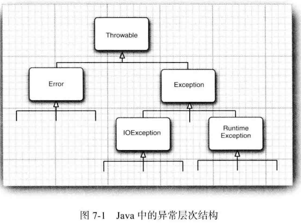
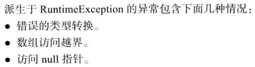
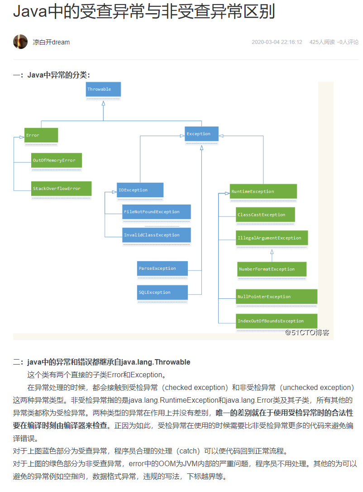
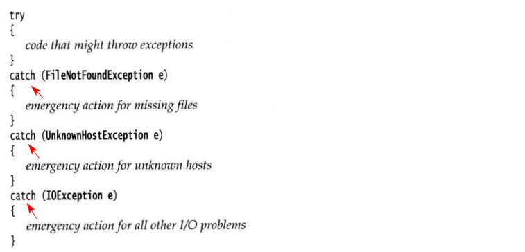

Java使用一种称为*异常处理（exception handling）*的错误捕获机制处理程序错误或异常。

# 7.1 处理错误

Java异常处理机制，当发生：用户输入错误、设备错误、物理限制、代码错误时，抛出（throw）一个封装了错误信息的对象，异常处理机制开始搜索能够处理这种异常状况的异常处理器（exception handler）。

7.1.1 异常分类

异常具有自己的语法和特定的继承结构

1）所有异常类都继承自：`Throwable`

2）异常的层次结构



- Error类

  - 应用程序不抛出此类异常（不归程序员管）
  - 描述了Java运行时系统内部错误和资源耗尽错误

- Exception类

  - 在设计Java程序时，程序员关注

  - 两个分支
    - RuntimeException：由程序错误导致的异常（**程序本身的问题**）
      
    - 其他异常：程序以外的异常（**程序本身没有问题**），如：I/O异常
      

3）如果出现RuntimeException异常，一定是程序员设计程序的问题。

4）受检异常和非受检异常

- 非受检异常：Error类和RuntimeException类及其所有子类
- 受检异常：除非受检异常外的异常，如：I/O、SQL，需要在编译时进行检查

- 两者本质区别：异常是否在程序编译时刻进行检查，受检异常在程序编译时检查，非受检异常在程序运行时检查。



7.1.2 声明受查异常

1）如果一个方法可能抛出多个**受查异常类型**，就必须在方法首部列出所有的异常类，每个异常类用逗号隔开。

```java
class MyAnimation{
    ...
    public Image loadImage(String s) throws FileNotFoundException, EOFException{
        ...
    }
}
```

2）在一个方法上，

- **不需要抛出受检查错误**，如：Error及子类错误

- **尽量避免**：RuntimeException及子类异常。

  RuntimeException运行时错误完全可控，应多花时间修正代码，而不是等待抛出异常。

  ```java
  class MyAnimation{
      ...
      void drawImage(int i) throws ArrayIndexOutOfBoundsException{ // bad style
          ...
      }
  }
  ```

3）总结：

一个方法必须声明所有可能抛出的受查异常， 而非受查异常要么不可控制（ Error)，要么就应该避免发生（ RuntimeException)。如果方法没有声明所有可能发生的受查异常， 编译器就会发出一个错误消息。

4）子类覆盖父类一个方法，此方法声明受检查异常，则子类中抛出的异常的范围应小于等于父类抛出的异常范围，即：抛出范围更小的异常，或不抛出任何异常。

7.1.3 如何抛出异常

1）throws方法上；throw方法内

```java
String readData(Scanner in) throws EOFException{
    ...
    while(...){
        if(!in.hasNext())// EOF encountered
        {
            if (n < len)
                throw new EOFException();
        }
        ...
    }
    return s;
}
```

2）抛出异常的思路？

1. 找到一个合适的异常类
2. 创建这个类的一个对象
3. 将对象抛出

7.1.4 创建异常类

1）Q：何时自定义异常类？

A：当JDK中标准异常类无法满足当前需求时。

2）自定义异常类应包含两个构造器：

- 默认的构造器
- 带有详细描述信息的构造器

```java
class FileFormatException extends IOException{
    public FileFormatException(){}
    public FileFormatException(String gripe){
        super(gripe); // 描述此异常信息
    }
}

String readData(BufferReader in) throws FileFormatException{
    ...
    while(...){
        if(ch == -1) // EOF encountered
        {
            if(n < len){
                // 抛出异常
                throw new FileFormatException();
            }
        }
    }
    return s;
}
```

# 7.2 捕获异常

7.2.1 捕获异常

1）语法格式

```java
try{
    code
    more code
    more code
}catch(ExceptionType e){
    handler for this type
}
```

情形1：如果在 try语句块中的任何代码抛出了一个在 catch 子句中说明的异常类， 那么

1. 程序将跳过 try语句块的其余代码
2. 程序将执行 catch 子句中的处理器代码

情形2：如果在 try 语句块中的代码没有拋出任何异常，那么程序将跳过 catch 子句

情形3：如果方法中的任何代码拋出了一个在 catch 子句中没有声明的异常类型，那么这个方法

就会立刻退出

2）编译器严格地执行throws说明符，如果调用了一个抛出受检查异常的方法，就必须对它进行处理，或者继续向上传递异常。

处理异常规则：

- **捕获**知道如何处理的异常

- **传递**不知道怎样处理的异常

  > 方法首部：throws，传递异常给调用方法

7.2.2 捕获多个异常

1）使用方式如下



7.2.3 再次抛出异常与异常链


7.2.4 finally子句

7.2.5 带资源的try语句

7.2.6 分析堆栈轨迹元素

# 7.3 使用异常机制的技巧


# 7.4 使用断言

7.4.1 断言的概念

7.4.2 启用和禁用断言

7.4.3 使用断言完成参数检查

7.4.4 为文档假设使用断言

# 7.5 记录日志

7.5.1 基本日志

7.5.2 高级日志

7.5.3 修改日志管理器配置

7.5.4 本地化

7.5.5 处理器

7.5.6 过滤器

7.5.7 格式化器

7.5.8 日志记录说明

# 7.6 调试技巧