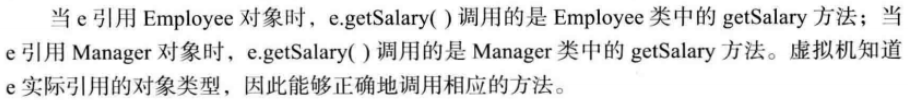

# 第5章：继承

Q：谈一谈多态？

A：Java中实现多态有两种方式：

- 继承，子类重写父类的方法
- 接口，类实现接口并重写接口中的方法

用父类和接口声明对象的引用变量，该变量能指向父类或子类，能指向实现类，这就是多态（polymorphism）。

在程序运行期间，能自动选择调用哪个方法（动态绑定，dynamic binding），如：引用变量用父类声明，调用子类重写父类的**同名方法时**，若引用变量指向父类，调用父类的方法；若指向子类时调用子类的方法。

**通常**：多态与`instanceof`关键字合用，可对父类及其所有子类，实现接口的类进行通用处理，使程序有良好的扩展性。（见实例2）

1）实例1

```java
// 父类:Employee
public double getSalary() {
	System.out.println("父类:getSalary()");
	return salary;
}

// 子类:Manager
public double getSalary() {
	System.out.println("子类:getSalary()");
	double baseSalary = super.getSalary();// 调用父类getSalary()
	return baseSalary + bonus;
}	
```

```java
// Employee -> Manager
Employee e = new  Manager("Test", 80000, 1987, 12, 15);
e.getSalary(); // 调用子类方法

e = new Employee("666", 6666, 1990, 3, 16);
e.getSalary(); // 调用父类方法

// 输出
子类:getSalary()
父类:getSalary()
80000.0
------------------
父类:getSalary()
6666.0
```



2）实例2

多态存在的三个必要条件

- 继承
- 重写
- 父类引用指向子类对象

比如：`Parent p = new Child();`

当使用多态方式：p调用方法时，**首先**检查父类中是否有该方法，如果没有，则编译错误；如果有，**再去调用子类的同名**方法。

```java
package com.ch05.inheritance;

public class Test {
	public static void main(String[] args) {
		show(new Cat()); // 以  Cat 对象调用 show 方法
		show(new Dog()); // 以  Dog 对象调用 show 方法
		
		Animal a = new Cat(); // 向上转型
		a.eat(); // 调用的是 Cat 的 eat
		Cat c = (Cat)a;// 向下转型
		c.work();// 调用的是 Cat 的 work
	}
	
	public static void show(Animal a) {
		a.eat();// 父类引用指向子类变量，调用子类的eat方法
		// 类型判断
		if(a instanceof Cat) { // 猫做的事情
			Cat c = (Cat)a;
			c.work();
		}else if (a instanceof Dog) { // 狗做的事情
			Dog c = (Dog)a;
			c.work();
		}
	}
}

abstract class Animal{
	abstract void eat();
}

class Cat extends Animal{
	public void eat() {
		System.out.println("吃鱼");
	}
	public void work() {
		System.out.println("抓老鼠");
	}
}

class Dog extends Animal{
	public void eat() {
		System.out.println("吃骨头");
	}
	public void work() {
		System.out.println("看家");
	}
}

// 输出
吃鱼
抓老鼠
吃骨头
看家
吃鱼
抓老鼠
```

